# PROJECT CONTEXT — TFI (Toma Física de Inventario)

> **Última actualización:** 2026-05-28
> **Versión del proyecto:** 79
> **Estado:** Operativo — Fase 7 (Dashboard V2 — Datos reales conectados 🆕)

---

# PROJECT OVERVIEW

## Objetivo General del Sistema

TFI es una aplicación web dashboard para visualizar y gestionar reportes de **toma física de inventario** en múltiples almacenes. Reemplaza hojas de cálculo y reportes manuales con un dashboard operativo en tiempo real.

**Usuarios objetivo:** Operadores de bodega/almacén y supervisores.

**Contexto de negocio:** En una toma física de inventario, dos operadores distintos (T1 y T2) cuentan los mismos artículos. Si sus conteos difieren, un supervisor hace un **reconteo**. El sistema calcula automáticamente qué operador contó correctamente y muestra discrepancias vs el teórico del WMS.

## Flujo Completo de Datos

```
┌──────────┐     ┌──────────┐     ┌──────────────┐     ┌──────────────┐
│   WMS    │ ──> │   N8N    │ ──> │   Supabase   │ ──> │   Frontend   │
│  (ERP)   │     │Workflows │     │  (PostgreSQL)│     │  (React SPA) │
└──────────┘     └──────────┘     └──────────────┘     └──────────────┘
                      │                                       │
                      │  webhook (disparador)                 │  polling
                      │<──────────────────────────────────────│  (cada 3s)
                      │                                       │
              ┌───────┴───────┐                               │
              │  n8n-webhook  │<── Edge Function ─────────────┘
              │  -proxy       │   (bypass CORS)
              └───────────────┘
```

1. **WMS → N8N:** N8N consulta la base de datos del WMS (SQL Server u Oracle) para extraer sesiones de inventario, conteos T1/T2, reconteos y situaciones.
2. **N8N → Supabase:** N8N inserta/actualiza datos en las tablas `tfi_sessions`, `tfi_count_lines`, y registra cada ejecución en `tfi_sync_runs`.
3. **Supabase → Frontend:** El frontend consulta **vistas SQL** (`v_tfi_comparison_lines`, `v_tfi_user_precision`, `v_tfi_global_precision`) que computan estados y métricas en tiempo real. **El frontend NUNCA hace cálculos de negocio — solo muestra lo que las vistas devuelven.**
4. **Frontend → N8N (sincronización):** El usuario hace clic en "Sincronizar" por almacén, el frontend dispara un webhook a N8N via la Edge Function `n8n-webhook-proxy`, y monitorea el progreso con polling cada 3 segundos.

## Módulos Funcionales del Negocio

| Módulo | Ruta | Descripción |
|--------|------|-------------|
| Dashboard | `/` | 8 KPIs + distribución de estados + accesos rápidos (Auto-detecta V1 vs V2) |
| Comparación T1 vs T2 | `/comparison` | Tabla línea por línea con filtros avanzados (V1 — modelo pivotado) |
| Comparación Dinámica | `/comparison-v2` | Comparación basada en tomas seleccionadas (V2 — modelo normalizado, datos reales) |
| Ranking de Usuarios | `/ranking` | 3 vistas: Conteos/Reconteos/Global. Auto-detección V1 vs V2 según origen de datos 🆕 |
| Pendientes de Reconteo | `/pending` | Artículos donde T1 ≠ T2, requieren acción del supervisor |

---

# DASHBOARD V2 — ARQUITECTURA NORMALIZADA 🆕

## Motivación

El Dashboard V1 (`/`) depende de `tfi_count_lines` + vistas `v_tfi_comparison_lines`, `v_tfi_global_precision`, `v_tfi_user_precision`. Para sesiones que solo tienen datos en `tfi_count_attempts` (como FEBECA con 19k+ registros), el dashboard V1 muestra vacío porque no hay datos en `tfi_count_lines`.

El Dashboard V2 usa exclusivamente `tfi_count_attempts` como fuente de verdad y dos RPCs en PostgreSQL para todo el cálculo de KPIs.

## Detección Automática V1 vs V2

El dashboard **detecta automáticamente** qué arquitectura usar:
- Si la sesión seleccionada tiene `attempt_lines > 0` → se activa V2
- Si no tiene datos en `tfi_count_attempts` → se mantiene V1 (legacy)

Esto se determina desde `SessionContext` que ya cuenta registros en ambas tablas.

## RPCs del Dashboard V2

### `get_dashboard_stats_v2(p_session_id UUID)` → DashboardV2Stats

✅ **Probado y funcionando.** Retorna KPIs agregados desde `tfi_count_attempts`.

**Sesión de prueba:** `f6318dca-faca-47e5-bc4e-483929710493` (TFI FEBECA)  
**Resultado:** 19,103 conteos, 6,253 artículos, 7,597 ubicaciones, 54 usuarios, 74 tomas, precisión 78.21%.

| Columna | Tipo | Descripción |
|---------|------|-------------|
| `total_conteos` | `BIGINT` | Total registros en tfi_count_attempts |
| `total_articulos` | `BIGINT` | Artículos distintos |
| `total_ubicaciones` | `BIGINT` | Ubicaciones distintas |
| `total_usuarios` | `BIGINT` | Usuarios distintos |
| `total_tomas` | `BIGINT` | Tomas distintas |
| `conteos_exactos` | `BIGINT` | count_qty = theoretical_qty |
| `conteos_con_diferencia` | `BIGINT` | count_qty ≠ theoretical_qty |
| `precision_global` | `NUMERIC` | exactos / total * 100 |
| `diferencia_absoluta_total` | `NUMERIC` | Σ\|count_qty - theoretical_qty\| |
| `tomas_normal` | `BIGINT` | Registros con take_type = 'NORMAL' |
| `tomas_reconteo` | `BIGINT` | Registros con take_type = 'RECONTEO' |
| `articulos_con_diferencia` | `BIGINT` | Artículos con al menos un conteo con diferencia |
| `articulos_sin_diferencia` | `BIGINT` | Artículos donde todos los conteos coincidieron |
| `conteos_faltantes` | `BIGINT` | Registros con count_qty IS NULL |

### `get_dashboard_v2_diffs(p_session_id UUID, p_limit INTEGER)` → DashboardV2Diff[]

Retorna los top N artículos con mayor diferencia acumulada, ordenados por `max_difference DESC`.

| Columna | Tipo | Descripción |
|---------|------|-------------|
| `article_id` | `TEXT` | Código de artículo |
| `article_description` | `TEXT` | Descripción |
| `total_conteos` | `BIGINT` | Conteos de este artículo |
| `exactos` | `BIGINT` | Conteos exactos |
| `con_diferencia` | `BIGINT` | Conteos con diferencia |
| `max_difference` | `NUMERIC` | Máxima diferencia absoluta |
| `ubicaciones` | `BIGINT` | Ubicaciones distintas |
| `tomas_normal` | `BIGINT` | Tomas tipo NORMAL |
| `tomas_reconteo` | `BIGINT` | Tomas tipo RECONTEO |
| `last_user` | `TEXT` | Último usuario que contó |
| `last_take_name` | `TEXT` | Última toma |
| `last_take_type` | `TEXT` | Tipo de última toma |
| `theoretical_qty` | `NUMERIC` | Cantidad teórica |

## KPIs del Dashboard V2

| KPI | Valor (FEBECA) | Descripción |
|-----|----------------|-------------|
| Total conteos | 19,103 | Registros en `tfi_count_attempts` |
| Artículos distintos | 6,253 | Artículos únicos |
| Ubicaciones distintas | 7,597 | Posiciones físicas |
| Usuarios participantes | 54 | Operadores distintos |
| Total tomas | 74 | Tomas distintas |
| Precisión global | 78.21% | Exactos / Total |
| Conteos exactos | 14,940 | count_qty = theoretical_qty |
| Conteos con diferencia | 4,163 | count_qty ≠ theoretical_qty |
| Diferencia absoluta total | 3,195,303 | Σ\|dif\| |

## Distribución por Tipo de Toma (V2)

| Tipo | Total | % |
|------|-------|---|
| NORMAL | 18,890 | 98.9% |
| RECONTEO | 213 | 1.1% |

## Distribución por Artículo (V2)

| Estado | Total | % |
|--------|-------|---|
| Sin diferencia | 3,801 | 60.8% |
| Con diferencia | 2,452 | 39.2% |

## Accesos Rápidos V2

- **Comparación Dinámica:** Link a `/comparison-v2` (la comparación V2 es el estándar para sesiones con datos normalizados)
- **Ranking de Usuarios:** Link a `/ranking` (auto-detecta V2)
- **Pendientes:** Link a `/pending` (muestra artículos con diferencia)

## Exportación V2

- **Excel:** `TFI_RESUMEN_V2_{sesion}_{fecha}.xlsx` — 4 hojas (Resumen, Distribución tipo, Distribución artículos, Top diferencias)
- **CSV:** `TFI_RESUMEN_V2_{sesion}_{fecha}.csv` — BOM UTF-8, resumen ejecutivo

## Archivos del Módulo Dashboard V2

```
src/
├── services/
│   └── dashboard-v2.service.ts          # getDashboardV2Stats(), getDashboardV2Diffs()
├── pages/
│   └── home/
│       └── page.tsx                      # Auto-detecta V1 vs V2, muestra KPIs correspondientes
├── types/
│   └── tfi.types.ts                      # + DashboardV2Stats, DashboardV2Diff
└── utils/
    ├── exportToExcel.ts                  # + exportDashboardV2ToExcel()
    └── exportToCsv.ts                    # + exportDashboardV2ToCsv()
```

## Coexistencia V1 y V2 en Dashboard

- **Misma página** (`/`) — no hay ruta separada
- **Detección automática:** `attempt_lines > 0` → V2, sino → V1
- **V1 intacto:** Todo el código legacy del dashboard (8 KPIs V1, gauge doble, distribución 7 estados, tabla de diferencias) se mantiene sin cambios
- **Sin interferencia:** Las queries V1 usan `tfi_count_lines` + vistas; V2 usa `tfi_count_attempts` + RPCs. Datos y lógica completamente separados.
- **Badge visual:** Cuando está en modo V2, el título muestra un badge "V2" en verde

## Rangos de Precisión V2

| Nivel | Rango | Badge Color |
|-------|-------|-------------|
| **Óptimo** | ≥98.01% | Verde (emerald) |
| **Bueno** | 93% – 98% | Ámbar |
| **Por mejorar** | < 93% | Rojo |

---

# RANKING V2 — ARQUITECTURA NORMALIZADA 🆕

## Motivación

El Ranking V1 (`/ranking` modo legacy) calcula métricas desde `tfi_count_lines` y la vista `v_tfi_comparison_lines`. Depende de columnas pivotadas (`count_1_qty`, `count_2_qty`, `user_1`, `user_2`). Para sesiones que solo tienen datos en `tfi_count_attempts` (como FEBECA con 19k+ registros), el ranking V1 no puede calcular métricas porque la estructura de datos es diferente.

El Ranking V2 usa exclusivamente `tfi_count_attempts` como fuente de verdad y un RPC en PostgreSQL para todo el cálculo.

## Detección Automática V1 vs V2

La página `/ranking` **detecta automáticamente** qué arquitectura usar:
- Si la sesión seleccionada tiene `attempt_lines > 0` → se activa V2
- Si no tiene datos en `tfi_count_attempts` → se mantiene V1 (legacy)

Esto se determina desde `SessionContext` que ya cuenta registros en ambas tablas.

## RPC: `get_user_ranking_v2`

### Parámetros

| Parámetro | Tipo | Descripción |
|-----------|------|-------------|
| `p_session_id` | `UUID` | Sesión activa |
| `p_take_names` | `TEXT[]` | Nombres de tomas a incluir (NULL = todas) |
| `p_take_type` | `TEXT` | `'NORMAL'`, `'RECONTEO'`, o NULL (ambos) |
| `p_user_search` | `TEXT` | Búsqueda parcial por user_id |

### Columnas de retorno

| Columna | Tipo | Descripción |
|---------|------|-------------|
| `user_id` | `TEXT` | ID/Ficha del operador |
| `total_articulos_contados` | `BIGINT` | Artículos distintos contados |
| `total_ubicaciones` | `BIGINT` | Ubicaciones distintas |
| `total_conteos` | `BIGINT` | Total de registros de conteo |
| `conteos_exactos` | `BIGINT` | Conteos donde count_qty = theoretical_qty |
| `conteos_con_diferencia` | `BIGINT` | Conteos donde count_qty ≠ theoretical_qty |
| `diferencia_absoluta_total` | `NUMERIC` | Suma de \|count_qty - theoretical_qty\| |
| `precision_porcentaje` | `NUMERIC` | conteos_exactos / total_conteos * 100 |

### Lógica

```sql
1. Filtra tfi_count_attempts por session_id
2. Excluye registros sin user_id y sin count_qty
3. Aplica filtros opcionales: take_names, take_type, user_search
4. Agrupa por user_id
5. Calcula métricas con COUNT DISTINCT, COUNT FILTER, SUM ABS
6. Ordena por precision_porcentaje DESC, total_conteos DESC
```

## Datos de Prueba (Sesión FEBECA)

| Métrica | Valor |
|---------|-------|
| Session ID | `f6318dca-faca-47e5-bc4e-483929710493` |
| Registros en `tfi_count_attempts` | 19,103 |
| Artículos distintos | 6,253 |
| Ubicaciones distintas | 7,597 |
| Tomas físicas disponibles | 74 (73 NORMAL + 1 RECONTEO) |
| Usuarios rankeados (NORMAL) | 54 |
| Top precisión (NORMAL, ≥20 conteos) | 93.75% (usuario 4275) |
| Top volumen (NORMAL) | lmontill: 2,661 conteos, 93.72% |
| Usuarios reconteo | 12 |

## Tomas disponibles (top 5 por volumen)

| Toma | Tipo | Artículos | Usuarios |
|------|------|-----------|----------|
| SEMESTRAL MENUDENCIA A | NORMAL | 3,213 | 24 |
| SEMESTRAL MENUDENCIA B | NORMAL | 3,105 | 23 |
| SEMESTRAL ORIGINAL B | NORMAL | 1,353 | 9 |
| SEMESTRAL ORIGINAL A | NORMAL | 1,348 | 33 |
| SEMESTRAL RECONTEO | RECONTEO | 213 | 12 |

## Tabs V2

| Tab | take_type | Descripción |
|-----|-----------|-------------|
| Conteos | `NORMAL` | Solo conteos normales (primera pasada) |
| Reconteos | `RECONTEO` | Solo reconteos (segunda pasada / supervisor) |
| Global | `NULL` (ambos) | Conteos + reconteos combinados |

## Filtros V2

- **Multi-select de tomas físicas:** Dropdown con checkboxes. Por defecto: todas las tomas del tab actual. Botones rápidos: "Seleccionar todas" / "Limpiar".
- **Búsqueda de usuario:** Filtro por user_id parcial (server-side via RPC).
- **Tabs:** Conteos / Reconteos / Global (cambia el `take_type` enviado al RPC).

## Tabla V2 — Columnas

| Columna | Descripción |
|---------|-------------|
| Pos. | Posición en el ranking |
| Usuario | user_id con avatar de iniciales |
| Artículos | Artículos distintos contados |
| Ubicaciones | Ubicaciones distintas |
| Total conteos | Total de registros |
| Exactos | Conteos donde count_qty = theoretical_qty |
| Con dif. | Conteos con diferencia |
| Dif. absoluta | Σ\|count_qty - theoretical_qty\| |
| % Precisión | Barra de precisión con color semáforo |
| Nivel | ÓPTIMO (≥98.01%) — Oro / BUENO (93%–98%) — Plata / POR MEJORAR (<93%) |

## Exportación V2

- **Excel:** `TFI_RANKING_V2_{tab}_{sesion}_{fecha}.xlsx` — una hoja con 11 columnas (incluye `Nivel Indicador` y `Reconocimiento`)
- **CSV:** `TFI_RANKING_V2_{tab}_{sesion}_{fecha}.csv` — BOM UTF-8, mismas columnas que Excel

## Archivos del Módulo Ranking V2

```
src/
├── types/
│   └── tfi.types.ts                    # + RankingV2Type, UserRankingV2, RankingV2Filters
├── services/
│   ├── ranking-v2.service.ts           # getRankingV2() — llama RPC get_user_ranking_v2
│   └── comparison-v2.service.ts        # getAvailableTakesV2() — reusado para el multi-select
├── pages/
│   └── ranking/
│       ├── page.tsx                     # Detecta V1 vs V2 automáticamente
│       └── components/
│           └── PrecisionBar.tsx         # Reusado en ambas versiones
└── utils/
    ├── exportToExcel.ts                 # + exportRankingV2ToExcel()
    └── exportToCsv.ts                   # + exportRankingV2ToCsv()
```

## Coexistencia V1 y V2 en Ranking

- **Misma página** (`/ranking`) — no hay ruta separada
- **Detección automática:** `attempt_lines > 0` → V2, sino → V1
- **V1 intacto:** Todo el código legacy de ranking (Conteos 1 y 2, Reconteos, Global Ponderado) se mantiene sin cambios
- **Sin interferencia:** Las queries V1 usan `tfi_count_lines` + vistas; V2 usa `tfi_count_attempts` + RPC. Datos y lógica completamente separados.
- **Badge visual:** Cuando está en modo V2, el título muestra un badge "V2" en verde

## Cálculo de Precisión V2

```
precision = conteos_exactos / total_conteos * 100

Donde:
- conteos_exactos = COUNT(*) FILTER (WHERE count_qty = theoretical_qty)
- total_conteos  = COUNT(*)

Un conteo es "exacto" cuando el operador contó exactamente lo que dice el WMS.
Un conteo tiene "diferencia" cuando count_qty ≠ theoretical_qty (sin importar magnitud).
```

## Rangos Oficiales TFI — Clasificación de Precisión

| Nivel | Rango | Reconocimiento | Color Badge |
|-------|-------|---------------|-------------|
| **ÓPTIMO** | 98.01% – 100% | Oro | Ámbar/Dorado |
| **BUENO** | 93% – 98% | Plata | Gris/Plata |
| **POR MEJORAR** | < 93% | — | Rojo |

**Orden de ranking:**
1. ÓPTIMO primero
2. BUENO segundo
3. POR MEJORAR tercero
4. Dentro de cada grupo, mayor precisión primero
5. Luego mayor cantidad de conteos

El ordenamiento lo maneja el RPC (`ORDER BY precision_porcentaje DESC, total_conteos DESC`) que naturalmente agrupa por nivel ya que el nivel depende directamente de `precision_porcentaje`.

A diferencia del V1 que calcula errores como `difference_user_1 = 1 cuando count_1_qty ≠ theoretical_qty`, el V2 trabaja directamente con la diferencia real (`count_qty - theoretical_qty`) y la precisión es binaria: coincidió o no coincidió.

---

# ARCHITECTURE

## Diagrama de Arquitectura (Mermaid)

```mermaid
flowchart TB
    subgraph External["🔵 WMS / ERP"]
        WMS_DB[(WMS Database)]
    end

    subgraph N8N["🟠 N8N Orchestrator"]
        WF1[Workflow: tfi-refresh<br/>Patio Febeca]
        WF2[Workflow: tfi-refresh1<br/>Febeca]
        WF3[Workflow: tfi-refresh2<br/>Sillaca]
        WF4[Workflow: tfi-refresh3<br/>Beval]
    end

    subgraph SupabaseCloud["🟢 Supabase Cloud"]
        subgraph DB["PostgreSQL Database"]
            T_SESS[tfi_sessions]
            T_LINES[tfi_count_lines]
            T_ATTEMPTS[tfi_count_attempts<br/>🆕 Tabla normalizada]
            T_SYNC[tfi_sync_runs]
            T_LOCKS[tfi_sync_locks]
            T_BRANCH[tfi_sync_run_branches]
            T_DEBUG[tfi_webhook_debug_logs]
            T_N8N[tfi_n8n_step_logs]
            
            V_COMP[v_tfi_comparison_lines]
            V_PREC[v_tfi_user_precision]
            V_GLOB[v_tfi_global_precision]
        end
        
        subgraph EF["Edge Functions"]
            PROXY[n8n-webhook-proxy]
        end
        
        subgraph RPC["Stored Procedures"]
            ACQ[acquire_tfi_sync_lock]
            REL[release_tfi_sync_lock]
            RPC_DASH1[get_dashboard_stats_v2<br/>🆕 Dashboard V2]
            RPC_DASH2[get_dashboard_v2_diffs<br/>🆕 Dashboard V2]
            RPC_TAKES[get_available_takes_v2]
            RPC_COMP2[get_comparison_v2]
            RPC_RANK2[get_user_ranking_v2<br/>🆕 Ranking V2]
        end
    end

    subgraph Frontend["🟣 Frontend SPA (Readdy/Vite)"]
        direction TB
        
        subgraph Context["State"]
            SC[SessionContext<br/>selectedSession<br/>selectedSituation]
        end
        
        subgraph Pages["Pages"]
            HOME[Dashboard /<br/>✅ Auto-detecta V1 vs V2]
            COMP[Comparación /comparison]
            COMP2[Comp. V2 /comparison-v2<br/>✅ Datos reales]
            RANK[Ranking /ranking<br/>✅ Auto-detecta V1 vs V2]
            PEND[Pendientes /pending]
        end
        
        subgraph Services["Services"]
            TFI[tfi.service.ts]
            DASH2[dashboard-v2.service.ts<br/>🆕 Dashboard V2]
            COMP2_SVC[comparison-v2.service.ts]
            RANK2_SVC[ranking-v2.service.ts<br/>🆕 Ranking V2]
            N8N_SVC[n8n.service.ts]
        end
        
        subgraph Components["Shared Components"]
            TOPNAV[TopNav]
            LAYOUT[AppLayout]
            WS[WarehouseSyncButtons]
            TCTL[TfiRefreshControl]
            EXPORT[ExportButtons]
        end
    end

    WMS_DB --> WF1 & WF2 & WF3 & WF4
    WF1 & WF2 & WF3 & WF4 --> T_SESS & T_LINES & T_ATTEMPTS & T_SYNC & T_BRANCH & T_DEBUG & T_N8N
    
    T_SESS & T_LINES --> V_COMP & V_PREC & V_GLOB
    T_ATTEMPTS --> RPC_TAKES & RPC_COMP2 & RPC_RANK2 & RPC_DASH1 & RPC_DASH2
    
    Frontend --> V_COMP & V_PREC & V_GLOB & T_SESS & T_SYNC & T_LOCKS & T_ATTEMPTS
    Frontend --> ACQ & REL
    Frontend --> RPC_TAKES & RPC_COMP2 & RPC_RANK2 & RPC_DASH1 & RPC_DASH2
    Frontend --> PROXY
    PROXY --> WF1 & WF2 & WF3 & WF4
```



## Componentes Principales y su Comunicación

### 1. Frontend (React SPA)
- **`src/services/tfi.service.ts`**: Capa de datos. Todas las queries a Supabase pasan por aquí. Usa el singleton `supabase` de `src/lib/supabase.ts`.
- **`src/services/dashboard-v2.service.ts`**: 🆕 Dashboard V2. Llama RPCs `get_dashboard_stats_v2` y `get_dashboard_v2_diffs`.
- **`src/services/n8n.service.ts`**: Dispara webhooks a N8N via la Edge Function `n8n-webhook-proxy` (para evitar CORS). Devuelve el `sync_run_id` que N8N genera.
- **`src/context/SessionContext.tsx`**: Estado global. Almacena `selectedSession`, `selectedSituation`, `sessions[]`, `refreshTrigger`.
- **`src/components/feature/WarehouseSyncButtons.tsx`**: Componente de sincronización por almacén con polling, locks y recovery automático.
- **`src/components/feature/TfiRefreshControl.tsx`**: Sincronización global (situación + webhook) en el TopNav.

### 2. Supabase (Base de Datos + Edge Functions)
- **Tablas base**: `tfi_sessions`, `tfi_count_lines` (alimentadas por N8N)
- **Tablas de control**: `tfi_sync_runs`, `tfi_sync_locks`, `tfi_sync_run_branches`
- **Tablas de log**: `tfi_webhook_debug_logs`, `tfi_n8n_step_logs`
- **Vistas SQL**: `v_tfi_comparison_lines`, `v_tfi_user_precision`, `v_tfi_global_precision` — **toda la lógica de negocio vive acá, NO en el frontend**
- **RPCs**: `acquire_tfi_sync_lock`, `release_tfi_sync_lock`, `get_available_takes_v2`, `get_comparison_v2`, `get_user_ranking_v2`, `get_dashboard_stats_v2`, `get_dashboard_v2_diffs`
- **Edge Function**: `n8n-webhook-proxy` — proxy HTTP para evitar CORS al llamar webhooks de N8N

### 4. Flujo de datos V2 (nuevo — producción)
```
N8N → INSERT tfi_count_attempts → RPC get_available_takes_v2 → TakeSelector (frontend)
N8N → INSERT tfi_count_attempts → RPC get_comparison_v2 → ComparisonV2Table (frontend)
N8N → INSERT tfi_count_attempts → RPC get_dashboard_stats_v2 → DashboardV2 (frontend)
N8N → INSERT tfi_count_attempts → RPC get_dashboard_v2_diffs → DashboardV2 diffs (frontend)
```
- Cada fila en `tfi_count_attempts` = una toma individual de un artículo en una ubicación
- Las RPCs agrupan dinámicamente por `(article_id, location_id)` y comparan la toma seleccionada
- Paginación y filtrado server-side (PostgreSQL → RPC → frontend)

### 3. N8N (Orquestador)
- 4 workflows independientes (uno por almacén)
- Cada workflow: consulta WMS → transforma datos → inserta en Supabase
- Expone webhooks que el frontend dispara para iniciar sincronización
- Auto-limpieza: marca syncs >60min como `failed`

---

# COMPARISON V2 — ARQUITECTURA NORMALIZADA 🆕

## Motivación

La arquitectura V1 (`/comparison`) usa el modelo **pivotado** de `tfi_count_lines`:
- Cada fila tiene columnas fijas: `count_1_qty`, `count_2_qty`, `user_1`, `user_2`, `take_1_name`, `take_2_name`
- Soporta exactamente **2 tomas + 1 reconteo** por artículo
- No escala a más tomas ni múltiples reconteos por ubicación

La arquitectura V2 (`/comparison-v2`) usa la tabla **normalizada** `tfi_count_attempts`:
- Cada fila = una toma individual de un artículo en una ubicación específica
- Soporta **infinitas tomas, múltiples reconteos y múltiples ubicaciones por artículo**
- La comparación se construye dinámicamente seleccionando Toma A y Toma B por `take_name`

## Tabla: `tfi_count_attempts` (NUEVA)

| Columna | Tipo | Descripción |
|---------|------|-------------|
| `id` | `bigint` (PK) | Autoincremental |
| `session_id` | `uuid` (FK) | FK a `tfi_sessions` |
| `article_id` | `text` | Código de artículo |
| `article_description` | `text` | Descripción del artículo |
| `take_order` | `integer` | Orden de la toma (1, 2, 3...) |
| `take_name` | `text` | Nombre descriptivo (ej: "TOMA 1 — Febeca") |
| `take_type` | `text` | Tipo: `count` o `recount` |
| `theoretical_qty` | `numeric` | Cantidad teórica según WMS |
| `count_qty` | `numeric` | Cantidad contada (NULL = pendiente) |
| `difference_qty` | `numeric` | Diferencia vs teórico |
| `user_id` | `text` | ID/Ficha del operador |
| `situation` | `text` | Situación (APLICADO/DISPONIBLE/CANCELADO) |
| `form_status` | `text` | Estado del formulario |
| `location_id` | `text` | Ubicación física dentro del almacén |
| `count_id` | `text` | ID del conteo en el WMS |
| `registered_at` | `timestamptz` | Fecha de registro en WMS |
| `created_at` | `timestamptz` | Fecha creación |
| `updated_at` | `timestamptz` | Fecha actualización |

**Diferencia clave vs `tfi_count_lines`:** Cada fila es UNA toma individual. Un mismo artículo puede tener N filas (una por cada toma + reconteos). La ubicación (`location_id`) es una dimensión adicional que permite granularidad por posición física.

## RPCs de Comparación V2

## RPCs de Comparación V2 — 🟢 VALIDADAS

### `get_available_takes_v2(p_session_id UUID)`

✅ **Probada y funcionando.** Retorna todas las tomas disponibles para una sesión desde `tfi_count_attempts`.

**Sesión de prueba:** `f6318dca-faca-47e5-bc4e-483929710493` (TFI FEBECA)  
**Resultado:** 170+ tomas disponibles con `take_type`: `NORMAL` y `RECONTEO`.

| Columna | Descripción |
|---------|-------------|
| `take_name` | Nombre de la toma (para selección) |
| `take_type` | `count` o `recount` |
| `take_order` | Orden numérico |
| `article_count` | Cantidad de artículos+ubicaciones en esta toma |

### `get_comparison_v2(...)` — 🟢 Validado — Motor de comparación dinámica

✅ **Probada y funcionando.**

**Test realizado:**
- Toma A: `SEMESTRAL MENUDENCIA A` (2,920 arts.)
- Toma B: `SEMESTRAL MENUDENCIA B` (291 arts.)
- **Total comparaciones:** 3,496 líneas
- **Estados confirmados:** MATCH, PENDING_TAKE_A, PENDING_TAKE_B, PENDING_RECOUNT, RECOUNT_MATCH_A, RECOUNT_MATCH_B, ALL_DIFFERENT
- **Agrupación correcta por:** `article_id` + `location_id`
- **19,103 registros** en `tfi_count_attempts` para esta sesión

**Parámetros:**
- `p_session_id UUID` — Sesión activa
- `p_take_a_name TEXT` — Nombre de la Toma A
- `p_take_b_name TEXT` — Nombre de la Toma B
- `p_article_search TEXT` (opcional) — Búsqueda por código/descripción
- `p_status_filter TEXT` (opcional) — Filtro por estado
- `p_page INTEGER` — Página (default 1)
- `p_page_size INTEGER` — Tamaño de página (default 20)

**Lógica de comparación:**

```sql
1. Agrupa por (article_id, location_id) — todos los pares donde exista Toma A o Toma B
2. Para cada par:
   - Obtiene el último count_qty de Toma A (mayor take_order)
   - Obtiene el último count_qty de Toma B
   - Obtiene el último recount (take_type='recount', mayor take_order)
3. Calcula comparison_status:
   - MATCH:             count_a = count_b
   - PENDING_RECOUNT:   count_a ≠ count_b, sin reconteo
   - RECOUNT_MATCH_A:   reconteo existe y coincide con Toma A
   - RECOUNT_MATCH_B:   reconteo existe y coincide con Toma B
   - ALL_DIFFERENT:     reconteo existe y no coincide con ninguna
   - PENDING_TAKE_A:    Toma A sin dato (count_qty NULL)
   - PENDING_TAKE_B:    Toma B sin dato
4. Calcula final_difference = recount_qty ?? take_b_qty ?? take_a_qty - theoretical_qty
```

**Ventajas del RPC:**
- Toda la lógica de negocio en PostgreSQL (no en frontend)
- Paginación server-side nativa
- Filtrado server-side
- `COUNT(*) OVER()` para total sin query adicional

## Estados de Comparación V2

| Estado | Significado | Color |
|--------|-------------|-------|
| `MATCH` | Ambas tomas coinciden | Verde (emerald) |
| `DIFFERENT` | Las tomas difieren | Rojo |
| `PENDING_RECOUNT` | Difieren, se necesita reconteo | Ámbar |
| `RECOUNT_MATCH_A` | Reconteo valida Toma A | Celeste (sky) |
| `RECOUNT_MATCH_B` | Reconteo valida Toma B | Índigo |
| `ALL_DIFFERENT` | Nadie coincide | Rojo |
| `PENDING_TAKE_A` | Falta dato de Toma A | Naranja |
| `PENDING_TAKE_B` | Falta dato de Toma B | Gris |

## Diferencias V1 vs V2

| Aspecto | V1 (`/comparison`) | V2 (`/comparison-v2`) |
|---------|-------------------|----------------------|
| **Tabla origen** | `tfi_count_lines` (pivotada) | `tfi_count_attempts` (normalizada) |
| **Columnas fijas** | count_1_qty, count_2_qty, user_1, user_2 | Dinámico por take_name |
| **N° máximo de tomas** | 2 (hardcodeado) | Infinitas |
| **Reconteos** | 1 por artículo | Múltiples (último gana) |
| **Ubicaciones** | No soportado | `location_id` como dimensión |
| **Selección de tomas** | Siempre T1 vs T2 | Usuario elige Toma A y Toma B |
| **Lógica** | Vista SQL `v_tfi_comparison_lines` | RPC `get_comparison_v2` |
| **Paginación** | Frontend (10 por página) | Server-side via RPC (20 por página) |
| **Estados** | match, ok_user1, ok_user2, pending_recount, both_different, etc. | MATCH, PENDING_RECOUNT, RECOUNT_MATCH_A/B, ALL_DIFFERENT |

## Archivos del Módulo V2

```
src/
├── types/
│   └── comparison-v2.types.ts          # Tipos: AvailableTake, ComparisonV2Line, etc.
├── services/
│   └── comparison-v2.service.ts        # RPC calls a Supabase (sin mocks)
├── pages/
│   └── comparison-v2/
│       ├── page.tsx                     # Página principal
│       └── components/
│           ├── TakeSelector.tsx         # Selector de Toma A / Toma B
│           ├── FilterBarV2.tsx          # Filtros (búsqueda, estado)
│           ├── ComparisonV2Table.tsx    # Tabla con 11 columnas + paginación
│           └── StatusBadgeV2.tsx        # Badges de estado V2
└── utils/
    ├── exportToExcel.ts                 # + exportComparisonV2ToExcel()
    └── exportToCsv.ts                   # + exportComparisonV2ToCsv()
```

## Coexistencia V1 y V2

- **V1 (`/comparison`):** Sigue funcionando sin cambios. Usa `tfi_count_lines` y `v_tfi_comparison_lines`.
- **V2 (`/comparison-v2`):** Nuevo módulo independiente. Usa `tfi_count_attempts` y RPCs.
- **Sin interferencia:** Tablas, vistas, servicios y tipos completamente separados.
- **Plan futuro:** Una vez que V2 esté maduro y `tfi_count_attempts` tenga datos de todos los almacenes, se migrarán Ranking y Pendientes a la nueva arquitectura, y V1 se deprecated.

## Mock Data — ❌ ELIMINADO

El archivo `src/mocks/comparisonV2.ts` fue eliminado. El módulo V2 ahora consume **exclusivamente datos reales** desde las RPCs de Supabase (`get_available_takes_v2`, `get_comparison_v2`). No hay fallback a datos mock.

## Integración Frontend ← Backend V2

- **Servicio:** `src/services/comparison-v2.service.ts` — llama RPCs directamente sin mock fallback
- **SessionContext:** `getSessions()` ahora cuenta tanto `tfi_count_lines` como `tfi_count_attempts` para no deshabilitar sesiones que solo tienen datos en V2
- **TopNav:** selector de sesión usa `Math.max(total_lines, attempt_lines)` para determinar si una sesión tiene datos
- **Auto-selección:** Elige las dos tomas con mayor `article_count`, sin filtrar por `take_type`

---

# DATABASES

## WMS Database

> **TODO:** Documentar tipo exacto de base de datos (probablemente SQL Server u Oracle), credenciales y esquema de tablas origen. Esto lo maneja N8N — el frontend nunca accede directamente al WMS.

- **Tipo:** SQL Server / Oracle (por confirmar)
- **Tablas utilizadas por N8N:** Sesiones de inventario, conteos T1/T2, reconteos, usuarios, situaciones
- **Datos extraídos:** `session_id`, `article_id`, `article_description`, `theoretical_qty`, `count_1_qty`, `count_2_qty`, `recount_qty`, usuarios, situaciones, estados de formulario

## Supabase

### Estructura de Tablas

#### `tfi_sessions` — Sesiones de inventario

| Columna | Tipo | Descripción |
|---------|------|-------------|
| `id` | `text` (PK) | UUID de sesión |
| `name` | `text` | Nombre descriptivo (ej: "Sillaca", "Febeca") |
| `status` | `text` | `open`, `reviewing`, `closed`, `cancelled`, `draft` |
| `location` | `text` | Ubicación/almacén |
| `created_at` | `timestamptz` | Fecha creación |
| `updated_at` | `timestamptz` | Fecha actualización |

**Uso en frontend:** Selector de sesión en TopNav. Se excluye la sesión "Sillaca pruebas" del selector.

#### `tfi_count_lines` — Líneas de conteo por artículo

| Columna | Tipo | Descripción |
|---------|------|-------------|
| `id` | `bigint` (PK) | Autoincremental |
| `session_id` | `text` (FK) | FK a `tfi_sessions.id` |
| `article_id` | `text` | Código de artículo |
| `article_description` | `text` | Descripción del artículo |
| `theoretical_qty` | `numeric` | Cantidad teórica según WMS |
| `count_1_qty` | `numeric` | Conteo operador T1 |
| `user_1` | `text` | ID/Ficha operador T1 |
| `take_1_name` | `text` | Nombre descriptivo toma 1 |
| `count_2_qty` | `numeric` | Conteo operador T2 |
| `user_2` | `text` | ID/Ficha operador T2 |
| `take_2_name` | `text` | Nombre descriptivo toma 2 |
| `recount_qty` | `numeric` | Cantidad reconteo (supervisor) |
| `recount_user` | `text` | Usuario que hizo reconteo |
| `situation_1` | `text` | Situación toma 1 (APLICADO/DISPONIBLE/CANCELADO) |
| `situation_2` | `text` | Situación toma 2 |
| `situation_recount` | `text` | Situación reconteo |
| `estado_formulario_1` | `text` | Estado formulario toma 1 |
| `estado_formulario_2` | `text` | Estado formulario toma 2 |
| `estado_formulario_recount` | `text` | Estado formulario reconteo |
| `created_at` | `timestamptz` | Fecha creación |
| `updated_at` | `timestamptz` | Fecha actualización |

**Uso en frontend:** Solo lectura via vistas. N8N inserta/actualiza. Importante: `difference_user_1` y `difference_user_2` NO existen en esta tabla — son columnas computadas en la vista `v_tfi_comparison_lines`.

#### `tfi_sync_runs` — Registro de ejecuciones de sincronización

| Columna | Tipo | Descripción |
|---------|------|-------------|
| `id` | `text` (PK) | UUID del sync run |
| `session_id` | `text` (FK) | FK a `tfi_sessions` |
| `situation` | `text` | Situación filtrada |
| `status` | `text` | `running`, `completed`, `failed` |
| `started_at` | `timestamptz` | Inicio |
| `finished_at` | `timestamptz` | Fin |
| `total_rows` | `integer` | Filas procesadas |
| `error_message` | `text` | Mensaje de error si falló |

**Uso en frontend:** Polling cada 3s para saber si un sync terminó. Si `status=running` por >60min, se considera "stale".

#### `tfi_sync_locks` — Control de concurrencia por sesión

| Columna | Tipo | Descripción |
|---------|------|-------------|
| `session_id` | `text` (PK) | FK a `tfi_sessions` |
| `is_running` | `boolean` | `true` si hay sync activo |
| `sync_run_id` | `text` | FK a `tfi_sync_runs` |
| `started_at` | `timestamptz` | Cuándo inició el lock |
| `finished_at` | `timestamptz` | Cuándo terminó |
| `updated_at` | `timestamptz` | Última actualización |
| `locked_by` | `text` | Origen del lock |
| `error_message` | `text` | Error del sync asociado |

**Uso en frontend:** RPC `acquire_tfi_sync_lock` adquiere, `release_tfi_sync_lock` libera. El recovery al cargar la página limpia locks huérfanos (>60min o >5min sin registros en `tfi_sync_runs`).

#### `tfi_sync_run_branches` — Ramas de ejecución N8N

> **TODO:** Documentar columnas exactas y propósito de esta tabla.

#### `tfi_n8n_step_logs` — Logs de pasos N8N

> **TODO:** Documentar columnas y uso.

#### `tfi_webhook_debug_logs` — Logs de debug de webhooks

> **TODO:** Documentar columnas y uso.

### Vistas SQL

#### `v_tfi_comparison_lines` — **LA VISTA MÁS IMPORTANTE**

Proyección enriquecida de `tfi_count_lines`. Columnas adicionales computadas:

| Columna Computada | Tipo | Lógica |
|-------------------|------|--------|
| `comparison_status` | `text` | Ver sección "Lógica de comparison_status" abajo |
| `final_count_qty` | `numeric` | `recount_qty ?? count_1_qty ?? count_2_qty` |
| `final_difference_vs_theoretical` | `numeric` | `final_count_qty - theoretical_qty` |
| `difference_user_1` | `integer` | 0 si coincide con teórico o recount; 1 si difiere |
| `difference_user_2` | `integer` | 0 si coincide con teórico o recount; 1 si difiere |

**Lógica de `comparison_status`:**

```sql
CASE
    WHEN count_1_qty IS NULL                    THEN 'pending_t1'
    WHEN count_2_qty IS NULL                    THEN 'pending_t2'
    WHEN count_1_qty = count_2_qty 
     AND count_1_qty = theoretical_qty          THEN 'match'
    WHEN count_1_qty <> count_2_qty 
     AND recount_qty IS NULL                    THEN 'pending_recount'
    WHEN recount_qty IS NOT NULL 
     AND recount_qty = count_1_qty              THEN 'ok_user1'
    WHEN recount_qty IS NOT NULL 
     AND recount_qty = count_2_qty              THEN 'ok_user2'
    WHEN recount_qty IS NOT NULL 
     AND recount_qty <> count_1_qty 
     AND recount_qty <> count_2_qty             THEN 'both_different'
    ELSE                                             'both_different'
END
```

> **IMPORTANTE:** "TOMA 1 OK" (`ok_user1`) significa "el reconteo validó que T1 contó correctamente" — **NO** significa "T1 coincide con el teórico del WMS".

#### `v_tfi_user_precision` — Precisión por usuario

| Columna | Tipo | Descripción |
|---------|------|-------------|
| `session_id` | `uuid` | FK sesión |
| `user_name` | `text` | Nombre/Ficha del operador |
| `total_articles` | `bigint` | Total artículos contados |
| `differences` | `bigint` | Artículos con diferencia |
| `precision_percentage` | `numeric` | % precisión |

**Uso en frontend:** Ranking legacy y export Excel (hoja Ranking).

#### `v_tfi_global_precision` — Precisión global de sesión

| Columna | Tipo | Descripción |
|---------|------|-------------|
| `session_id` | `uuid` | FK sesión |
| `total_user_counts` | `bigint` | Total conteos |
| `total_differences` | `bigint` | Total diferencias |
| `weighted_global_precision` | `numeric` | Precisión ponderada por volumen |
| `average_global_precision` | `numeric` | Precisión promedio simple |

### RLS Policies

Todas las políticas actuales son **full-access** (`true` para `USING` y `WITH CHECK`):

| Tabla | Policy | Comandos |
|-------|--------|----------|
| `tfi_count_lines` | `allow_all_count_lines` | ALL |
| `tfi_sessions` | `allow_all_sessions` | ALL |
| `tfi_sync_runs` | `tfi_sync_runs_select_frontend` | SELECT |
| `tfi_sync_run_branches` | `tfi_sync_run_branches_select_frontend` | SELECT |

> **NOTA:** Las políticas actuales son permisivas porque el sistema es interno. Si se expone a internet, RESTRINGIR con RLS apropiado.

### Stored Procedures (RPC)

- **`acquire_tfi_sync_lock(p_session_id, p_sync_run_id)`** → `boolean`: Intenta adquirir lock para una sesión. Retorna `false` si ya está bloqueada.
- **`release_tfi_sync_lock(p_session_id, p_error)`** → `void`: Libera el lock y registra error opcional.
- **`get_dashboard_stats_v2(p_session_id UUID)`** → `DashboardV2Stats`: Retorna KPIs agregados desde `tfi_count_attempts`.
- **`get_dashboard_v2_diffs(p_session_id UUID, p_limit INTEGER)`** → `DashboardV2Diff[]`: Retorna top N artículos con mayor diferencia.
- **`get_available_takes_v2(p_session_id UUID)`** → `AvailableTake[]`: Retorna tomas disponibles.
- **`get_comparison_v2(...)`** → `ComparisonV2Line[]`: Motor de comparación dinámica.
- **`get_user_ranking_v2(...)`** → `UserRankingV2[]`: Ranking de usuarios desde `tfi_count_attempts`.

---

# N8N FLOWS

> **TODO:** Documentar en detalle cada workflow de N8N: nodos, transformaciones, queries SQL al WMS, manejo de errores. Actualmente solo se conoce la estructura desde el lado del frontend (webhooks y tablas destino).

## Workflows Conocidos

| Webhook URL | Almacén | Session ID (Supabase) |
|-------------|---------|----------------------|
| `https://sandboxn8n.mayoreo.biz/webhook/tfi-refresh` | Patio Febeca | `4e2ed739-0f8f-475e-92af-aa8333e83efa` |
| `https://sandboxn8n.mayoreo.biz/webhook/tfi-refresh1` | Febeca | `f6318dca-faca-47e5-bc4e-483929710493` |
| `https://sandboxn8n.mayoreo.biz/webhook/tfi-refresh2` | Sillaca | `ccbf13c4-c0ac-4a7e-900e-bd2965a34339` |
| `https://sandboxn8n.mayoreo.biz/webhook/tfi-refresh3` | Beval | `db053880-e067-4062-bd4c-c124e3ab20f0` |

## Qué Hace Cada Workflow (alto nivel)

1. Recibe POST con `{ session_id, session_name, situation, location, ... }`
2. Consulta el WMS para extraer conteos de esa sesión + situación
3. Inserta/actualiza en `tfi_sessions` y `tfi_count_lines`
4. Crea registro en `tfi_sync_runs` con status `running`
5. Al finalizar, actualiza `tfi_sync_runs.status` a `completed` o `failed`
6. Auto-limpieza: si un sync lleva >60min en `running`, lo marca como `failed`

## Triggers

- **Webhook:** Disparado manualmente desde el frontend al hacer clic en "Sincronizar"
- **Cron / Schedule:** > **TODO:** Confirmar si hay ejecuciones programadas automáticas

## Dependencias Entre Workflows

- Cada workflow es **independiente** (un almacén no afecta a otro)
- El `tfi_sync_locks` previene ejecuciones concurrentes del mismo almacén
- El frontend bloquea sincronizaciones simultáneas de distintos almacenes

## Manejo de Errores en N8N

- Si el WMS no responde → el sync queda como `running` (o `failed` tras timeout)
- Si Supabase no responde → el sync falla con mensaje de error
- Auto-limpieza a los 60 minutos marca como `failed`

---

# FRONTEND

## Stack Utilizado

| Categoría | Tecnología | Versión |
|-----------|------------|---------|
| Framework | React (SPA) | 19.1+ |
| Lenguaje | TypeScript | 5.8 |
| Build Tool | Vite | 8.0 |
| Estilos | TailwindCSS | 3.4 |
| Routing | React Router DOM | 7.6 |
| Base de Datos | Supabase JS Client | 2.57 |
| i18n | react-i18next + i18next | 25.4 / 15.6 |
| Gráficos | Recharts | 3.2 |
| Exportación | xlsx + file-saver | 0.18 / 2.0 |
| Iconos | Remix Icon + Font Awesome 6 | CDN |
| Fuente | Inter (Google Fonts) | — |

## Estructura de Carpetas

```
src/
├── components/
│   ├── base/           # EmptyState, ErrorState, LoadingState
│   └── feature/        # AppLayout, TopNav, WarehouseSyncButtons,
│                       # TfiRefreshControl, ExportButtons
├── context/
│   └── SessionContext.tsx   # Estado global (sesión, situación, refreshTrigger)
├── hooks/              # (vacío actualmente)
├── i18n/
│   ├── index.ts        # Configuración i18next
│   └── local/
│       └── index.ts    # Auto-import de archivos de traducción
├── lib/
│   └── supabase.ts     # Singleton Supabase client + health check
├── mocks/              # Mock data (sin uso actual — datos vienen de Supabase)
├── pages/
│   ├── home/
│   │   ├── page.tsx    # Dashboard (Auto-detecta V1 vs V2)
│   │   └── components/
│   │       └── KpiCard.tsx
│   ├── comparison/
│   │   ├── page.tsx    # Comparación T1 vs T2
│   │   └── components/
│   │       ├── ComparisonTable.tsx  # Tabla con paginación (10 por página)
│   │       ├── FilterBar.tsx        # Filtros de búsqueda
│   │       └── StatusBadge.tsx      # Badge de estado (MATCH, TOMA 1 OK, etc.)
│   ├── ranking/
│   │   ├── page.tsx    # Ranking de usuarios
│   │   └── components/
│   │       └── PrecisionBar.tsx     # Barra de precisión con color
│   └── pending/
│       └── page.tsx    # Pendientes de reconteo
├── router/
│   ├── config.tsx      # Definición de rutas
│   └── index.ts        # AppRoutes + navigatePromise global
├── services/
│   ├── tfi.service.ts         # Todas las queries a Supabase + RPCs
│   ├── dashboard-v2.service.ts  # 🆕 Dashboard V2 RPCs
│   ├── comparison-v2.service.ts  # 🆕 RPC calls V2
│   └── n8n.service.ts         # Disparo de webhooks a N8N via Edge Function
├── types/
│   ├── tfi.types.ts           # Tipos TypeScript para todo el dominio
│   └── comparison-v2.types.ts # 🆕 Tipos V2 (AvailableTake, ComparisonV2Line, etc.)
├── mocks/
│   └── comparisonV2.ts        # 🆕 Mock data para /comparison-v2
├── utils/
│   ├── exportToExcel.ts    # Exportación a Excel (xlsx)
│   ├── exportToCsv.ts      # Exportación a CSV
│   └── exportHelpers.ts    # Funciones compartidas de exportación
├── App.tsx             # Entry point: BrowserRouter + Providers
├── main.tsx            # ReactDOM.createRoot
└── index.css           # Tailwind directives + Inter font
```

## Routing

| Ruta | Componente | Descripción |
|------|-----------|-------------|
| `/` | `Home` (Dashboard) | KPIs + distribución + accesos rápidos (Auto-detecta V1 vs V2) |
| `/comparison` | `ComparisonPage` | Tabla T1 vs T2 con filtros (V1) |
| `/comparison-v2` | `ComparisonV2Page` | Comparación dinámica basada en tomas (V2) 🆕 |
| `/ranking` | `RankingPage` | Ranking con 3 vistas (conteos/reconteos/global) |
| `/pending` | `PendingPage` | Artículos pending_recount |
| `*` | `NotFound` | Página 404 |

**Reglas importantes de routing:**
- `src/router/config.tsx` exporta `RouteObject[]` — NO modificar `src/router/index.ts`
- `src/router/index.ts` define `AppRoutes` y `navigatePromise` — NO redefinir en `App.tsx`
- `src/App.tsx` usa `BrowserRouter` con `basename={__BASE_PATH__}`
- `__BASE_PATH__` es inyectado por Vite `define`

## Manejo de Estado

### SessionContext (estado global)

```typescript
interface SessionContextValue {
  sessions: TfiSessionWithCount[];    // Todas las sesiones (con conteo de líneas)
  selectedSession: string;             // ID de sesión activa
  setSelectedSession: (id) => void;    // Cambiar sesión
  loadingSessions: boolean;            // Carga inicial
  sessionsError: string | null;        // Error de carga
  selectedSituation: string;           // Filtro global de situación (TODOS/APLICADO/...)
  setSelectedSituation: (s) => void;   // Cambiar situación
  refreshTrigger: number;              // Contador — incrementar fuerza refresh
  triggerRefresh: () => void;          // Incrementa refreshTrigger
}
```

**Flujo de selección de sesión:**
1. Al cargar, busca sesiones con `getSessions()` (ordenadas: con datos primero, luego sin datos)
2. Excluye "Sillaca pruebas" permanentemente
3. Selecciona: sesión activa con datos > sesión activa sin datos > primera visible
4. Toggle "ocultar sin datos" filtra visualmente

## Services / API Layer

### `tfi.service.ts` — Capa de datos Supabase

Todas las queries usan el singleton `supabase` de `src/lib/supabase.ts`.

**Funciones principales:**

| Función | Retorna | Descripción |
|---------|---------|-------------|
| `getSessions()` | `TfiSessionWithCount[]` | Sesiones + conteo real de líneas |
| `getComparisonLines(filters)` | `TfiComparisonLine[]` | Líneas con filtros |
| `getUserPrecision(sessionId?)` | `TfiUserPrecision[]` | Precisión por usuario (vista) |
| `getGlobalPrecision(sessionId?)` | `TfiGlobalPrecision \| null` | Precisión global (vista) |
| `getPendingRecount(sessionId?)` | `TfiComparisonLine[]` | Solo pending_recount |
| `getDashboardStats(sessionId?)` | `DashboardStats` | KPIs completos (frontend calcula conteos) |
| `getRankingData(sessionId?)` | `RankingsBundle` | Rankings en 3 categorías (frontend calcula) |
| `getDistinctUsers(sessionId?)` | `{ users1, users2 }` | Usuarios únicos para filtros |
| `getAvailableSituations(sessionId)` | `string[]` | Situaciones disponibles |
| `acquireSyncLock(sessionId, syncRunId)` | `boolean` | RPC — adquirir lock |
| `releaseSyncLock(sessionId, error?)` | `void` | RPC — liberar lock |
| `getSyncLocks()` | `TfiSyncLock[]` | Todos los locks |
| `getSyncLock(sessionId)` | `TfiSyncLock \| null` | Lock específico |
| `getRunningSyncForSession(sessionId)` | `TfiSyncRun \| null` | Sync activo |
| `getLatestSyncRun(sessionId)` | `TfiSyncRun \| null` | Último sync |
| `getAllComparisonLinesForExport(filters)` | `TfiComparisonLine[]` | SIN límite (paginación interna) |
| `getAllPendingRecountForExport(sessionId?)` | `TfiComparisonLine[]` | SIN límite |
| `getAllLinesForDashboardExport(sessionId?)` | `TfiComparisonLine[]` | SIN límite |
| `getAllLinesForRanking(sessionId?)` | `TfiComparisonLine[]` | Ranking columns mínimo |
| `calculateRankings(lines)` | `RankingsBundle` | Cálculo de rankings (frontend puro) |

**Importante:** `fetchAllPages()` se usa para bypass del límite de 1000 rows de Supabase. Consulta en lotes de 1000 hasta agotar.

### `dashboard-v2.service.ts` — Dashboard V2 🆕

- `getDashboardV2Stats(sessionId)` → `DashboardV2Stats | null` — Llama RPC `get_dashboard_stats_v2`
- `getDashboardV2Diffs(sessionId, limit)` → `DashboardV2Diff[]` — Llama RPC `get_dashboard_v2_diffs`

### `n8n.service.ts` — Comunicación con N8N

- `triggerTfiRefresh(payload, webhookUrl?)` → `string` (sync_run_id)
- Usa `supabase.functions.invoke('n8n-webhook-proxy', ...)` para evitar CORS
- Valida que el `sync_run_id` retornado sea UUID válido (rechaza placeholders `{{...}}`)
- Manejo de errores HTTP (404, 401, 403, 5xx) con mensajes amigables

## Componentes Importantes

### `WarehouseSyncButtons` — Sincronización por almacén
- 4 cards (Patio Febeca, Febeca, Sillaca, Beval)
- Estados: `idle → starting → syncing → success/error`, más `stale`
- **Polling cada 3 segundos** verifica `tfi_sync_runs` por `session_id`
- **Recovery al montar:** limpia locks stale (>60min) y huérfanos (>5min sin registros)
- **Bloqueo global:** si un almacén está sincronizando, los demás se deshabilitan
- Toast de notificación (éxito/error/warning) flotante

### `TfiRefreshControl` — Control de sync en TopNav
- Selector de situación (TODOS, APLICADO, DISPONIBLE, CANCELADO)
- Sincronización global via webhook (mismo flujo que WarehouseSyncButtons pero simplificado)
- Usa `localStorage` para persistir `sync_run_id` entre recargas

### `TopNav` — Navegación superior
- Fixed header con scroll detection (no tiene bg hasta hacer scroll)
- Logo "TFI." con link a `/`
- 4 nav items con active state (emerald)
- Selector de sesión (dropdown) + toggle "ocultar sin datos"
- Indicador "En vivo" con pulso verde
- Integra `TfiRefreshControl`
- Mobile: hamburger menu con mismos elementos

### `ExportButtons` — Botones de exportación
- Excel (.xlsx con múltiples hojas usando librería `xlsx`)
- CSV (.csv con BOM UTF-8)
- Dashboard V1: 5 hojas (Resumen, Distribución, Ranking, Pendientes, Diferencias críticas)
- Dashboard V2: 4 hojas (Resumen, Distribución tipo, Distribución artículos, Top diferencias)
- Comparación: 2 hojas (Comparación, Diferencias críticas)
- Ranking: varía según tipo (Conteos/Reconteos/Global)

## Pantallas Principales

### Dashboard (`/`)
- **Auto-detecta V1 vs V2** según si la sesión tiene datos en `tfi_count_attempts`
- **V1:** 8 KPI cards (total conteos, diferencias, precisión ponderada, precisión promedio, pendientes reconteo, matches, T1 OK, T2 OK), gauge doble, distribución 7 estados, tabla de diferencias
- **V2:** 8 KPI cards (total conteos, artículos, ubicaciones, usuarios, precisión global, exactos, con diferencia, dif. absoluta), gauge simple, distribución por tipo, distribución por artículo, top diferencias
- **Exportación:** V1 = 5 hojas Excel, V2 = 4 hojas Excel

### Comparación (`/comparison`)
- Tabla con 13 columnas, paginación de 10 por página
- Filtros: artículo (búsqueda), usuario T1, usuario T2, estado, situación, solo diferencias, pendientes reconteo
- Summary pills: Total, MATCH, Pendientes, Con diferencia
- Filas `pending_recount` con fondo ámbar
- **Exportación:** Excel 2 hojas + CSV con todas las líneas filtradas

### Ranking (`/ranking`)
- 3 tabs: Conteos T1 y T2, Reconteos, Global Ponderado
- Búsqueda de usuario con filtro en tiempo real
- Barras de precisión con colores semáforo (verde ≥95%, ámbar ≥85%, rojo <85%)
- Medallas para top 3 con datos suficientes (≥20 artículos)
- Badge de nivel (Bueno/Regular/Malo/Muestra insuficiente)
- **Exportación:** Excel + CSV según tipo de ranking seleccionado

### Pendientes (`/pending`)
- Tabla con fondo ámbar para todas las filas
- Columnas: artículo, descripción, teórico, T1, usuario T1, T2, usuario T2, diferencias, estado
- Banner de alerta con CTA para ir a comparación
- Búsqueda por código o descripción de artículo
- Badge numérico con total de pendientes
- **Exportación:** Excel + CSV

## Flujo de Autenticación

**No hay autenticación implementada actualmente.** El sistema es de uso interno. Las credenciales de Supabase están en `.env` con clave anónima pública. N8N tiene sus propias credenciales para escribir en Supabase.

---

# ENVIRONMENT VARIABLES

| Variable | Obligatoria | Descripción |
|----------|-------------|-------------|
| `VITE_PUBLIC_SUPABASE_URL` | **SÍ** | URL del proyecto Supabase (ej: `https://nnhtstifbrljcufaoguk.supabase.co`) |
| `VITE_PUBLIC_SUPABASE_ANON_KEY` | **SÍ** | Clave anónima de Supabase para queries frontend |
| `VITE_N8N_TFI_REFRESH_WEBHOOK_URL` | **SÍ** | URL del webhook de N8N para sync global |
| `BASE_PATH` | No | Subdirectorio de deploy (default: `/`) |
| `IS_PREVIEW` | No | Modo preview de Readdy |
| `PROJECT_ID` | No | ID de proyecto Readdy |
| `VERSION_ID` | No | ID de versión Readdy |
| `READDY_AI_DOMAIN` | No | Dominio AI de Readdy |

**Variables por entorno:**
- **Desarrollo:** `.env` local
- **Producción:** Variables configuradas en el dashboard de Readdy/despliegue

---

# CURRENT FUNCTIONALITIES

## Funcionalidades Existentes (✅ Completadas)

- ✅ Layout global con navegación superior fija
- ✅ Dashboard con auto-detección V1 vs V2, KPIs reales desde Supabase
- ✅ Dashboard V1: 8 KPIs legacy, gauge doble, distribución 7 estados, tabla de diferencias
- ✅ Dashboard V2: 8 KPIs desde `tfi_count_attempts`, gauge simple, distribución por tipo y artículo, top diferencias
- ✅ Comparación T1 vs T2 con 13 columnas, paginación y 7 filtros (V1)
- ✅ Comparación Dinámica V2 con toma A/B seleccionables, paginación server-side, 8 estados 🆕
- ✅ Ranking de usuarios con auto-detección V1 vs V2
- ✅ Pendientes de reconteo con búsqueda y banner de acción
- ✅ Selector de sesión global (desde TopNav)
- ✅ Selector de situación global (TODOS, APLICADO, DISPONIBLE, CANCELADO)
- ✅ Exportación Excel multi-hoja para todas las pantallas (V1 y V2)
- ✅ Exportación CSV para todas las pantallas (V1 y V2)
- ✅ Sincronización desde WMS via N8N (4 almacenes con webhooks independientes)
- ✅ Polling de estado de sincronización cada 3 segundos
- ✅ Recovery automático de locks huérfanos al cargar la página
- ✅ Bloqueo de sincronizaciones concurrentes (locks en BD)
- ✅ Paginación interna para bypass del límite de 1000 rows de Supabase
- ✅ Situaciones disponibles cargadas dinámicamente por sesión
- ✅ Integración con Supabase Edge Function `n8n-webhook-proxy`
- ✅ Cálculo de rankings en frontend (conteos 1+2, reconteos, global ponderado)
- ✅ Toggle "ocultar sesiones sin datos" en TopNav
- ✅ Exclusión de sesiones de prueba ("Sillaca pruebas")

## Módulos Críticos

1. **`v_tfi_comparison_lines`**: Si esta vista falla, todo el frontend V1 deja de funcionar. Contiene la lógica de negocio core.
2. **`tfi_sync_locks` + RPCs**: Sin locks, sincronizaciones concurrentes pueden corromper datos.
3. **`tfi_sync_runs`**: Sin registros de sync, el polling no sabe cuándo terminar.
4. **Edge Function `n8n-webhook-proxy`**: Sin proxy, el frontend no puede llamar a N8N por CORS.
5. **`SessionContext`**: Todo el frontend depende del session_id seleccionado.

---

# PENDING IMPROVEMENTS

## Funcionalidades Pendientes

- [x] **Comparación V2 — Arquitectura normalizada:** ✅ Conectada a datos reales via RPCs. Sesión Febeca: 3,496 comparaciones, 19k+ registros en `tfi_count_attempts`. Sin mock data.
- [x] **Dashboard V2 — Datos reales:** ✅ Conectado a `tfi_count_attempts` via RPCs. Auto-detección V1 vs V2. 8 KPIs, distribución, top diferencias. Sin mock data.
- [ ] **RLS granular:** Reemplazar políticas `allow_all` por políticas basadas en roles
- [ ] **Dashboard con gráficos:** Gráficos de tendencia (Recharts ya está instalado)
- [ ] **Exportación programada:** Envío automático de reportes por email
- [ ] **Internacionalización completa:** Actualmente las traducciones no están pobladas (solo estructura)
- [ ] **Modo oscuro:** Soporte para dark mode
- [ ] **Filtros avanzados:** Rango de fechas, filtro por ubicación, filtro por diferencia mínima
- [ ] **Notificaciones en tiempo real:** Supabase Realtime para cambios sin necesidad de refresh manual
- [ ] **Dashboard de logs:** Vista de `tfi_webhook_debug_logs` y `tfi_n8n_step_logs`

## Problemas Conocidos

1. **Locks huérfanos:** Si N8N se cae después de adquirir lock pero antes de crear `tfi_sync_runs`, el lock queda para siempre. Mitigado con recovery automático (>5min sin registros).
2. **Polling infinito:** Si N8N nunca termina ni falla un sync, el frontend hace polling indefinido. Mitigado con stale threshold (60min).
3. **Sin rate limiting:** Los webhooks no tienen rate limiting — un usuario podría disparar múltiples syncs simultáneos si el frontend no los bloquea.
4. **CORS en N8N:** El proxy Edge Function es un workaround. Idealmente N8N debería configurar CORS correctamente.
5. **1000 rows limit:** Supabase limita queries a 1000 rows. El frontend usa `fetchAllPages()` con paginación interna, lo cual es ineficiente para sesiones muy grandes.

## Deuda Técnica

- `calculateRankings()` hace cálculos en frontend que idealmente deberían estar en una vista SQL
- `SessionContext` mezcla lógica de selección con exclusión hardcodeada de "Sillaca pruebas"
- URLs de webhooks hardcodeadas en `WarehouseSyncButtons.tsx` (deberían ser variables de entorno)
- Los archivos de i18n están vacíos — la app usa strings hardcodeados en español
- `tfi.types.ts` tiene aliases redundantes (`ComparisonLine = TfiComparisonLine`, etc.) para backward compatibility
- `TfiRefreshControl` y `WarehouseSyncButtons` tienen lógica de sync duplicada

## Riesgos Técnicos

- **Dependencia de N8N:** Si N8N está caído, no se pueden sincronizar datos del WMS
- **Dependencia de Supabase:** Si Supabase está caído, toda la app deja de funcionar
- **Sin autenticación:** Cualquiera con la URL puede ver datos de inventario
- **Sin backups automáticos:** Depende de los backups de Supabase
- **WMS single point of failure:** Si el WMS no responde, N8N no puede extraer datos

---

# DEVELOPMENT GUIDE

## Cómo Levantar el Proyecto

```bash
# 1. Clonar / abrir el proyecto
cd tfi-project

# 2. Instalar dependencias
npm install

# 3. Configurar variables de entorno (.env)
# Asegurate de tener VITE_PUBLIC_SUPABASE_URL, VITE_PUBLIC_SUPABASE_ANON_KEY,
# y VITE_N8N_TFI_REFRESH_WEBHOOK_URL

# 4. Iniciar en desarrollo
npm run dev
# → http://localhost:3000

# 5. Build de producción
npm run build
# → /out/
```

## Comandos Importantes

| Comando | Descripción |
|---------|-------------|
| `npm run dev` | Servidor de desarrollo (puerto 3000) |
| `npm run build` | Build de producción |
| `npm run preview` | Previsualizar build |
| `npm run lint` | ESLint con max-warnings 0 |
| `npm run type-check` | TypeScript type checking |

## Cómo Desplegar

El despliegue se hace a través de la plataforma **Readdy.ai**. El build output va a `/out/`. Las variables de entorno se configuran en el dashboard de Readdy.

## Cómo Probar Cambios

1. **Frontend:** `npm run dev` → verificar en `http://localhost:3000`
2. **TypeScript:** `npm run type-check` (siempre antes de commit)
3. **Build:** `npm run build` → verificar que compile sin errores
4. **Supabase:** Las queries se prueban contra la instancia real (no hay entorno local)
5. **N8N:** Los webhooks se prueban contra el sandbox de N8N (`sandboxn8n.mayoreo.biz`)

## Flujo Recomendado para Desarrollo

1. **Entender el cambio:** Leer `PROJECT_CONTEXT.md` y `project_plan.md`
2. **Identificar archivos:** Usar `grep` para encontrar código relacionado
3. **Modificar con cuidado:**
   - NO modificar `src/router/index.ts` ni `src/i18n/local/index.ts`
   - NO modificar `index.html` (salvo SEO tags)
   - NO modificar `package.json devDependencies`
   - La lógica de negocio vive en Supabase views — si necesitás cambiar cómo se calcula `comparison_status`, modificá la vista SQL, NO el frontend
4. **Verificar build:** `npm run type-check && npm run build`
5. **Probar en dev:** `npm run dev` y verificar visualmente
6. **Actualizar docs:** Si el cambio afecta arquitectura, actualizar `PROJECT_CONTEXT.md`

---

# INTEGRATIONS

## APIs Externas

| API | URL | Propósito |
|-----|-----|-----------|
| N8N Webhook (Patio Febeca) | `https://sandboxn8n.mayoreo.biz/webhook/tfi-refresh` | Sincronización almacén |
| N8N Webhook (Febeca) | `https://sandboxn8n.mayoreo.biz/webhook/tfi-refresh1` | Sincronización almacén |
| N8N Webhook (Sillaca) | `https://sandboxn8n.mayoreo.biz/webhook/tfi-refresh2` | Sincronización almacén |
| N8N Webhook (Beval) | `https://sandboxn8n.mayoreo.biz/webhook/tfi-refresh3` | Sincronización almacén |
| Supabase REST API | `https://nnhtstifbrljcufaoguk.supabase.co` | Base de datos |
| Supabase Edge Functions | `https://nnhtstifbrljcufaoguk.supabase.co/functions/v1/` | Serverless functions |

## Webhooks

- **N8N recibe:** `POST { session_id, session_name, situation, location, timestamp, triggered_from, warehouse, warehouse_id }`
- **N8N responde:** `{ sync_run_id: string }` (UUID)
- El proxy en Edge Function toma el payload del frontend y lo reenvía a N8N

## Servicios Terceros

- **Supabase:** Base de datos + Edge Functions + RPCs
- **N8N:** Orquestador de workflows (instancia self-hosted en `sandboxn8n.mayoreo.biz`)
- **WMS:** Sistema ERP externo (consultado por N8N, no directamente por el frontend)
- **Google Fonts:** Inter (cargada via CDN en `index.html`)
- **Remix Icon / Font Awesome:** Cargados via CDN en `index.html`

## Dependencias Externas Críticas

1. **Supabase** — si está caído, la app no funciona
2. **N8N** — si está caído, no se puede sincronizar
3. **WMS** — si está caído, N8N no puede extraer datos (las sincronizaciones fallarán)

---

# DEBUGGING

## Logs Importantes

### Consola del Navegador
- `[Supabase] getSyncRunById`, `getRunningSyncForSession`, `getLatestSyncRun`: Cada query de sync loguea parámetros y resultados
- `[SyncLock] acquireSyncLock`, `releaseSyncLock`, `getSyncLocks`: Logs de locks con session_id y errores
- `[N8N Webhook]`: URL, payload, HTTP status, response body, sync_run_id recibido
- `[Poll] {warehouseName}`: Estado del polling (running, completado, huérfano)
- `[Recovery] {warehouseName}`: Estado de locks al cargar la página (stale, huérfano, activo)
- `[TFI]`: Logs de TfiRefreshControl (sync global)

### Supabase
- Tabla `tfi_webhook_debug_logs`: Logs de webhooks recibidos
- Tabla `tfi_n8n_step_logs`: Logs de pasos de N8N
- Tabla `tfi_sync_runs`: Estado de cada sync (running/completed/failed + error_message)
- Tabla `tfi_sync_locks`: Estado actual de locks

### N8N
- Los workflows tienen sus propios logs en la UI de N8N
- Auto-limpieza: syncs >60min se marcan como `failed`

## Problemas Comunes

| Problema | Causa Probable | Solución |
|----------|---------------|----------|
| "Ya existe una sincronización en curso" | Lock huérfano en `tfi_sync_locks` | Limpiar manualmente: `UPDATE tfi_sync_locks SET is_running = false WHERE session_id = '...'` |
| "Sincronización atascada" (>60min) | N8N se colgó sin actualizar el sync run | El recovery lo limpia automáticamente al cargar la página |
| Webhook responde 404 | URL del webhook incorrecta o N8N caído | Verificar URLs en `WarehouseSyncButtons.tsx` y estado de N8N |
| Tabla vacía sin error | `session_id` no coincide con datos en Supabase | Verificar que la sesión seleccionada tenga datos en `tfi_count_lines` |
| Diferencia entre dashboard y comparación | Límite de 1000 rows de Supabase | El dashboard usa `fetchAllPages` que trae todos; la UI usa queries directas con paginación visual |
| sync_run_id inválido ("{{...}}") | N8N devolvió placeholder sin procesar | El frontend lo rechaza automáticamente (usa fallback por session_id) |

## Cómo Diagnosticar Errores

1. **Abrir DevTools (F12) → Console:** Buscar logs con prefijos `[Supabase]`, `[SyncLock]`, `[N8N Webhook]`, `[Poll]`, `[Recovery]`
2. **Verificar Supabase:** SQL Editor → consultar `tfi_sync_runs`, `tfi_sync_locks`, `tfi_count_lines`
3. **Verificar N8N:** UI de N8N → ver executions del workflow correspondiente
4. **Verificar CORS:** Si el proxy falla, verificar que la Edge Function `n8n-webhook-proxy` esté desplegada

## Puntos Críticos del Sistema

1. **`v_tfi_comparison_lines`**: Si los datos no se ven, verificar que la vista esté correcta y tenga datos
2. **`tfi_sync_locks.is_running`**: Estado `true` sin sync activo = lock huérfano
3. **`tfi_sync_runs.status`**: Si queda en `running` >60min, es un sync zombie
4. **Proxy CORS**: Si el proxy falla, ningún webhook funciona — verificar Edge Function en dashboard de Supabase
5. **`refreshTrigger` en SessionContext**: Si los datos no se actualizan después de sync, verificar que `triggerRefresh()` se llame correctamente

---

# AI / DEVELOPER CONTEXT

## Reglas Importantes del Proyecto

1. **La lógica de negocio vive en Supabase views, NO en el frontend.** Si necesitás cambiar cómo se calcula `comparison_status`, `final_count_qty`, etc., modificá la vista SQL en Supabase.
2. **El frontend solo consulta y muestra.** No recalcula métricas excepto los rankings (`calculateRankings`) y los conteos del dashboard.
3. **Nunca modificar `src/router/index.ts`** — es de solo lectura. Las rutas se definen en `src/router/config.tsx`.
4. **Nunca modificar `src/i18n/local/index.ts`** — es de solo lectura, auto-importa archivos de traducción.
5. **Usar `import { X } from 'react'`** — prohibido `React.X`.
6. **Usar `@/` para imports cross-directory** — prohibido `../`.
7. **TypeScript estricto** — `npm run type-check` debe pasar sin errores.

## Convenciones de Código

- **Nombres:** camelCase para variables/funciones, PascalCase para componentes/interfaces, snake_case para columnas de BD
- **Componentes:** Functional components con TypeScript interfaces para props
- **Servicios:** Funciones async que retornan datos tipados, errores se propagan con `throw`
- **Estilos:** TailwindCSS utility classes, NO CSS modules, NO styled-components
- **Iconos:** Remix Icon (`ri-*`) y Font Awesome (`fa-*` o `fas fa-*`) via CDN
- **Exportaciones:** Nombradas, NO default exports (excepto componentes de página)
- **Archivos:** Máximo ~500 líneas por archivo

## Cosas que NO se Deben Modificar

| Archivo | Razón |
|---------|-------|
| `src/router/index.ts` | Define `AppRoutes` y `navigatePromise` — estructura fija de Readdy |
| `src/i18n/local/index.ts` | Auto-import de traducciones — estructura fija |
| `index.html` (excepto SEO tags) | Estructura de Vite + CDNs |
| `package.json devDependencies` | Fijo según el template de Readdy |
| `vite.config.ts` (excepto `define` externals) | Configuración de build |
| `tailwind.config.ts` (excepto `theme.extend`) | Configuración base |

## Dependencias Delicadas

- **React 19** — NO downgradear. Si una dependencia pide React <19, buscar alternativa compatible.
- **react-router-dom 7** — Algunas APIs cambiaron vs v6. Verificar compatibilidad.
- **Supabase JS Client 2.57** — Usar `.maybeSingle()` en vez de `.single()` para evitar errores cuando no hay resultados.
- **xlsx 0.18** — La exportación Excel usa formato AOA (Array of Arrays).
- **TailwindCSS 3.4** — NO usar `@apply border-border` (no existe).

## Flujo Recomendado para Agregar Nuevas Funcionalidades

1. **Identificar el tipo de cambio:**
   - ¿Nueva página? → Crear `src/pages/[name]/page.tsx` + agregar ruta en `config.tsx`
   - ¿Nuevo filtro/KPI? → Verificar si la vista SQL ya tiene los datos. Si no, modificar la vista primero.
   - ¿Nueva integración? → Agregar función en `src/services/` + tipos en `src/types/`
   - ¿Nuevo componente compartido? → `src/components/feature/` o `src/components/base/`

2. **Para nuevas páginas:**
   - Crear carpeta en `src/pages/[name]/` con `page.tsx` y `components/` si necesario
   - Usar `AppLayout` como wrapper
   - Importar desde `@/context/SessionContext` para acceder a `selectedSession`
   - Agregar ruta en `src/router/config.tsx` y link en `TopNav.tsx`

3. **Para nuevas queries a Supabase:**
   - Agregar función en `src/services/tfi.service.ts`
   - Agregar tipos en `src/types/tfi.types.ts`
   - Si la query necesita superar 1000 rows, usar `fetchAllPages()`

4. **Verificar build:** `npm run type-check && npm run build`

5. **Actualizar documentación:** Si el cambio es significativo, actualizar `project_plan.md` y `PROJECT_CONTEXT.md`

---

> **Nota para IAs:** Este documento fue generado analizando el código fuente (versión 70), la base de datos Supabase, y el historial de cambios. Las secciones marcadas con **TODO** requieren información que no está disponible en el código fuente (típicamente la configuración de N8N y el esquema del WMS).