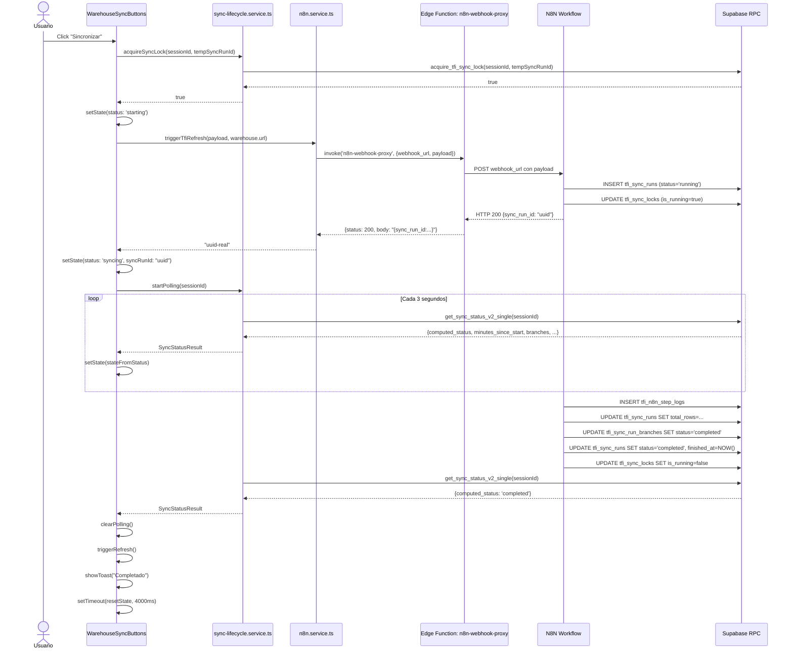
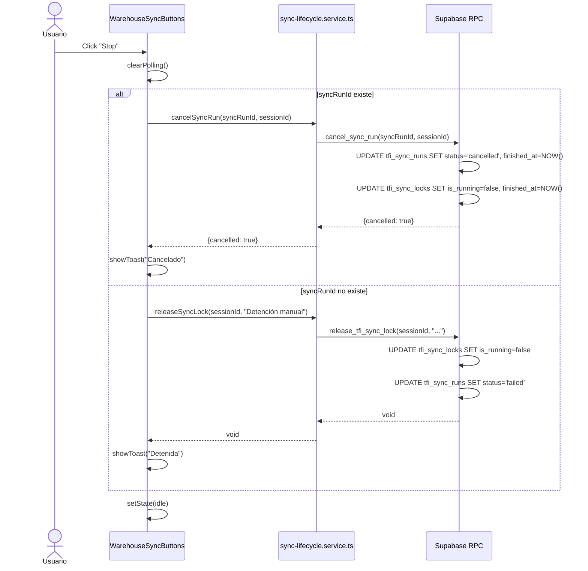
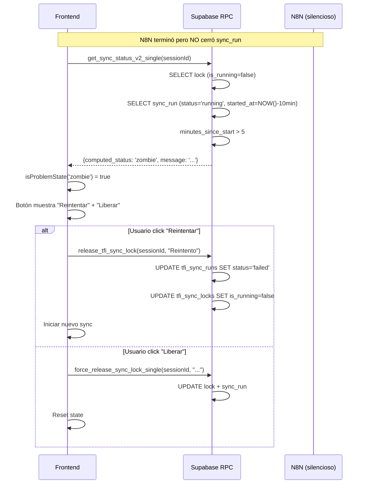
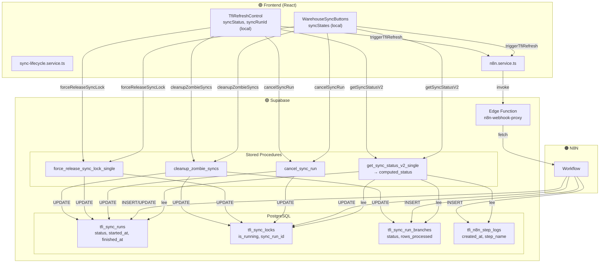

# TFI SYNC ARCHITECTURE REPORT

> **Fecha:** 2026-05-28
> **Versión:** 1.0
> **Propósito:** Documentación técnica exhaustiva del sistema de sincronización frontend ↔ Supabase ↔ N8N
> **Scope:** SIN cambios, SIN refactorización — solo análisis y documentación del estado actual

---

## Índice

1. [Arquitectura General](#1-arquitectura-general)
2. [Componentes React Involucrados](#2-componentes-react-involucrados)
3. [Servicios y Lógica](#3-servicios-y-lógica)
4. [RPCs Supabase](#4-rpcs-supabase)
5. [Tablas Supabase](#5-tablas-supabase)
6. [Flujo Exacto del Botón "Sincronizar"](#6-flujo-exacto-del-botón-sincronizar)
7. [Flujo Exacto del Botón "Stop"](#7-flujo-exacto-del-botón-stop)
8. [Polling](#8-polling)
9. [Estados Actuales del Sistema](#9-estados-actuales-del-sistema)
10. [Integración con N8N](#10-integración-con-n8n)
11. [Riesgos Actuales](#11-riesgos-actuales)
12. [Performance](#12-performance)
13. [Dependencias Ocultas](#13-dependencias-ocultas)
14. [Diagramas Mermaid](#14-diagramas-mermaid)
15. [Recomendaciones](#15-recomendaciones)

---

## 1. Arquitectura General

### 1.1 Diagrama de Flujo Completo

```
┌─────────────────────────────────────────────────────────────────────────────────────┐
│                                 FRONTEND (React SPA)                                 │
│  ┌──────────────────┐  ┌──────────────────┐  ┌──────────────────┐                   │
│  │ WarehouseSyncButtons│  │ TfiRefreshControl │  │     TopNav       │                   │
│  │   (4 almacenes)    │  │   (sync global)   │  │   (navegación)   │                   │
│  └────────┬───────────┘  └────────┬───────────┘  └────────┬───────────┘                   │
│           │                       │                       │                           │
│           ▼                       ▼                       ▼                           │
│  ┌─────────────────────────────────────────────────────────────────┐                   │
│  │              sync-lifecycle.service.ts (polling)                 │                   │
│  └─────────────────────────────────────────────────────────────────┘                   │
│           │                       │                       │                           │
│           └───────────────────────┴───────────────────────┘                           │
│                                   │                                                   │
│                                   ▼                                                   │
│  ┌─────────────────────────────────────────────────────────────────┐                   │
│  │              n8n.service.ts (webhook trigger)                    │                   │
│  └─────────────────────────────────────────────────────────────────┘                   │
│                                   │                                                   │
└───────────────────────────────────┼───────────────────────────────────────────────────┘
                                    │
                                    ▼
┌─────────────────────────────────────────────────────────────────────────────────────┐
│                              SUPABASE CLOUD                                         │
│  ┌────────────────────────┐                    ┌────────────────────────────────────┐  │
│  │  Edge Functions        │                    │  PostgreSQL Database              │  │
│  │  n8n-webhook-proxy    │◄───────────────────│  ───────────────────────────────  │  │
│  │  (bypass CORS)        │  supabase.functions  │  Tables: tfi_sessions             │  │
│  │                       │   .invoke()          │        tfi_count_lines            │  │
│  │  POST webhook_url     │                    │        tfi_count_attempts         │  │
│  │  + payload            │                    │        tfi_sync_runs              │  │
│  │  ─► fetch() ─► N8N   │                    │        tfi_sync_locks             │  │
│  │                       │                    │        tfi_sync_run_branches      │  │
│  │  ◄── JSON body ───────│                    │        tfi_n8n_step_logs          │  │
│  │     {status, body}    │                    │        tfi_webhook_debug_logs     │  │
│  └────────────────────────┘                    │  RPCs: acquire_tfi_sync_lock      │  │
│           │                                    │        release_tfi_sync_lock        │  │
│           │                                    │        get_sync_status_v2_single    │  │
│           │                                    │        cancel_sync_run              │  │
│           │                                    │        cleanup_zombie_syncs         │  │
│           │                                    │        force_release_sync_lock_single│  │
│           │                                    │  Views: v_tfi_comparison_lines      │  │
│           │                                    │        v_tfi_user_precision         │  │
│           │                                    │        v_tfi_global_precision       │  │
│           │                                    └────────────────────────────────────┘  │
│           │                                                                           │
└───────────┼───────────────────────────────────────────────────────────────────────────┘
            │
            ▼
┌─────────────────────────────────────────────────────────────────────────────────────┐
│                              N8N (Orquestador)                                      │
│  ┌─────────────────────────────────────────────────────────────────────────────┐   │
│  │  4 Workflows Independientes (uno por almacén):                               │   │
│  │  ──────────────────────────────────────────────────────────────────────────  │   │
│  │  tfi-refresh   (Patio Febeca) → session_id: 4e2ed739-0f8f-475e-92af-...   │   │
│  │  tfi-refresh1  (Febeca)       → session_id: f6318dca-faca-47e5-bc4e-...   │   │
│  │  tfi-refresh2  (Sillaca)      → session_id: ccbf13c4-c0ac-4a7e-900e-...   │   │
│  │  tfi-refresh3  (Beval)        → session_id: db053880-e067-4062-bd4c-...   │   │
│  │                                                                              │   │
│  │  Cada workflow:                                                              │   │
│  │  1. Recibe webhook POST con payload                                          │   │
│  │  2. Consulta WMS (SQL Server/Oracle)                                          │   │
│  │  3. Inserta/actualiza tfi_sessions, tfi_count_lines, tfi_count_attempts      │   │
│  │  4. Actualiza tfi_sync_runs (status, total_rows, finished_at)                │   │
│  │  5. Actualiza tfi_sync_locks (is_running = false, finished_at)              │   │
│  │  6. Inserta tfi_n8n_step_logs (heartbeat)                                   │   │
│  └─────────────────────────────────────────────────────────────────────────────┘   │
└─────────────────────────────────────────────────────────────────────────────────────┘
```

### 1.2 Source of Truth

| Fuente | Qué controla | Estado |
|--------|-------------|--------|
| **Backend (Supabase)** | `computed_status`, `minutes_since_start`, `is_running`, `sync_run.status` | **ÚNICA fuente de verdad** |
| Frontend | Renderizado de UI, polling intervals, toast notifications | **SOLO renderizado** |
| N8N | Inserta/actualiza datos, cierra sync_run, libera lock | **ORQUESTADOR** |

### 1.3 Lifecycle Actual

El ciclo de vida se divide en 3 fases principales:

1. **START** — Frontend adquiere lock + dispara webhook
2. **RUNNING** — N8N procesa + frontend hace polling
3. **FINISH** — N8N cierra sync_run + libera lock → frontend detecta terminal state

---

## 2. Componentes React Involucrados

### 2.1 WarehouseSyncButtons

| Atributo | Valor |
|----------|-------|
| **Archivo** | `src/components/feature/WarehouseSyncButtons.tsx` |
| **Líneas** | ~1056 |
| **Responsabilidad** | 4 cards de sincronización (Patio Febeca, Febeca, Sillaca, Beval). Polling por almacén, bloqueo global, recovery al montar, botón STOP real, force unlock modal, debug panel. |
| **Props** | Ninguna — usa `useSession()` para `selectedSituation` y `triggerRefresh` |
| **Dependencias** | `useSession`, `triggerTfiRefresh`, `sync-lifecycle.service.ts` (8 funciones), `tfi.types.ts` |
| **State interno** | `syncStates` (Record<warehouseId, WarehouseSyncState>), `toast`, `showForceModal`, `forceLoading`, `showDebugPanel` |
| **Refs** | `pollIntervalsRef` (Record<warehouseId, setInterval>), `pollAttemptsRef`, `mountedRef` |

**Flujo de ejecución:**
1. `useEffect` al montar → `cleanupZombieSyncs` + `getSyncStatusV2` para cada warehouse → `startPolling` si `isActiveState`
2. `handleSync` → valida `hasActiveSync` → si problem state, `releaseSyncLock` → `acquireSyncLock` → `triggerTfiRefresh` → `startPolling`
3. `handleStop` → `cancelSyncRun` (REAL) o `releaseSyncLock` fallback
4. `handleForceUnlock` → `forceReleaseSyncLock` modal

### 2.2 TfiRefreshControl

| Atributo | Valor |
|----------|-------|
| **Archivo** | `src/components/feature/TfiRefreshControl.tsx` |
| **Líneas** | ~550 |
| **Responsabilidad** | Sync global en TopNav. Selector de situación, botón sincronizar, polling, resume desde localStorage, debug panel, force unlock modal. |
| **Props** | Ninguna — usa `useSession()` |
| **Dependencias** | `useSession`, `triggerTfiRefresh`, `sync-lifecycle.service.ts`, `tfi.service.ts` (`getAvailableSituations`) |
| **State interno** | `syncStatus`, `syncRunId`, `syncMessage`, `syncRows`, `syncBranches`, `minutesSinceStart`, `lastN8nStepAt`, `lastN8nStepName`, `startedAt`, `finishedAt`, `errorMessage`, `toast`, `availableSituations`, `showForceModal`, `forceLoading`, `showDebugPanel` |
| **Refs** | `isStartingRef`, `pollIntervalRef`, `pollAttemptsRef`, `mountedRef` |
| **LocalStorage** | `tfi_active_sync_run_id`, `tfi_active_sync_session_id` |

**Flujo de ejecución:**
1. `useEffect` al montar → resume desde `localStorage` → `cleanupZombieSyncs` → `getSyncStatusV2` → resume polling si activo
2. `handleRefresh` → `triggerTfiRefresh` → guarda `localStorage` → `pollWithStatusV2`
3. `handleStop` → `cancelSyncRun` (REAL) o `releaseSyncLock` fallback
4. `handleForceUnlock` → `forceReleaseSyncLock`

### 2.3 SessionContext

| Atributo | Valor |
|----------|-------|
| **Archivo** | `src/context/SessionContext.tsx` |
| **Responsabilidad** | Estado global. `selectedSession`, `selectedSituation`, `sessions[]`, `refreshTrigger` (contador que fuerza re-render). |
| **Dependencias** | `tfi.service.ts` (`getSessions`) |
| **Trigger refresh** | `triggerRefresh()` incrementa `refreshTrigger` → re-carga `getSessions()` y fuerza re-render de consumidores |

### 2.4 TopNav

| Atributo | Valor |
|----------|-------|
| **Archivo** | `src/components/feature/TopNav.tsx` |
| **Responsabilidad** | Header fijo con navegación, selector de sesión, indicador "En vivo", integra `TfiRefreshControl`. |
| **Dependencias** | `useSession`, `react-router-dom`, `TfiRefreshControl` |

### 2.5 Hooks / State Management

**NO hay React Query.** El polling se implementa manualmente con `setInterval` en ambos componentes (`WarehouseSyncButtons` y `TfiRefreshControl`).

**NO hay custom hooks** para sincronización. Todo el polling y estado de sync vive inline en los componentes.

---

## 3. Servicios y Lógica

### 3.1 sync-lifecycle.service.ts

| Atributo | Valor |
|----------|-------|
| **Archivo** | `src/services/sync-lifecycle.service.ts` |
| **Responsabilidad** | Única interfaz frontend para todo el ciclo de vida de sincronización. Exporta constantes, helpers de estado, y funciones de RPC. |
| **Constantes** | `SYNC_TIMEOUT_MINUTES = 60`, `STALE_N8N_MINUTES = 10`, `ORPHAN_LOCK_MINUTES = 5`, `POLL_INTERVAL_MS = 3000`, `MAX_POLL_ATTEMPTS = 1200` |

| Función | RPC/Query | Retorno | Descripción |
|---------|-----------|---------|-------------|
| `getSyncStatusV2` | `get_sync_status_v2_single` | `SyncStatusResult \| null` | Fuente de verdad del estado de sync |
| `cancelSyncRun` | `cancel_sync_run` | `CancelSyncResult` | Cancelación REAL (marca `cancelled`) |
| `updateSyncHeartbeat` | Direct query (UPDATE + INSERT) | `void` | Actualiza `updated_at` y loguea paso |
| `forceReleaseSyncLock` | `force_release_sync_lock_single` | `ForceReleaseResult` | Liberación forzada + marca sync_run como failed |
| `cleanupZombieSyncs` | `cleanup_zombie_syncs` | `SyncCleanupResult` | Limpieza automática de zombies |
| `acquireSyncLock` | `acquire_tfi_sync_lock` | `boolean` | Adquiere lock con upsert |
| `releaseSyncLock` | `release_tfi_sync_lock` | `void` | Libera lock + marca sync_run como failed |
| `getSyncLocks` | Direct query (SELECT) | `TfiSyncLock[]` | Todos los locks |
| `getSyncLock` | Direct query (SELECT .eq) | `TfiSyncLock \| null` | Lock específico |
| `getSyncRunById` | Direct query (SELECT) | `TfiSyncRun \| null` | Legacy — aún exportada |
| `getRunningSyncForSession` | Direct query (SELECT) | `TfiSyncRun \| null` | Legacy — aún exportada |
| `getLatestSyncRun` | Direct query (SELECT) | `TfiSyncRun \| null` | Legacy — aún exportada |

| Helper | Descripción |
|--------|-------------|
| `isActiveState` | `syncing \| starting \| queued \| finishing` |
| `isProblemState` | `stale \| timeout \| orphaned \| zombie \| partial_failure` |
| `isTerminalState` | `completed \| failed \| cancelled \| idle` |
| `isCancellableState` | `syncing \| starting \| queued \| running \| finishing` |
| `formatElapsed` | `12m 34s` desde minutos decimales |

### 3.2 n8n.service.ts

| Atributo | Valor |
|----------|-------|
| **Archivo** | `src/services/n8n.service.ts` |
| **Responsabilidad** | Disparar webhook a N8N vía Edge Function proxy. Extraer `sync_run_id` de la respuesta. Manejo de errores HTTP. |
| **Edge Function** | `n8n-webhook-proxy` |
| **Payload** | `{session_id, session_name, location, situation, triggered_from, timestamp, warehouse?, warehouse_id?}` |
| **Retorno** | `string` (sync_run_id o '') |
| **Defensas** | Valida URL, valida `supabase.functions.invoke`, valida que `sync_run_id` sea UUID real (rechaza `{{...}}`), maneja errores HTTP 404/401/403/5xx |

### 3.3 tfi.service.ts

| Atributo | Valor |
|----------|-------|
| **Archivo** | `src/services/tfi.service.ts` |
| **Responsabilidad** | Capa de datos general. Queries a Supabase para sesiones, comparación, ranking, dashboard. **También exporta funciones de sync legacy** (`acquireSyncLock`, `releaseSyncLock`, `getSyncLocks`, etc.) que están DUPLICADAS en `sync-lifecycle.service.ts`. |

### 3.4 Polling — Implementación Real

**NO usa React Query.** Ambos componentes implementan polling manual con `setInterval`:

```typescript
// WarehouseSyncButtons
const poll = async () => {
  const attempts = (pollAttemptsRef.current[warehouseId] ?? 0) + 1;
  pollAttemptsRef.current[warehouseId] = attempts;

  if (attempts > MAX_POLL_ATTEMPTS) {
    clearPolling(warehouseId);
    setSyncStates(...timeout...);
    return;
  }

  const syncStatus = await getSyncStatusV2(sessionId);
  setSyncStates(...stateFromStatus(syncStatus)...);

  if (isTerminalState(syncStatus.computed_status)) {
    clearPolling(warehouseId);
    // triggerRefresh, toast, reset after delay
  }

  if (isProblemState(syncStatus.computed_status)) {
    // log warning, continue polling
  }
};

pollIntervalsRef.current[warehouseId] = setInterval(poll, POLL_INTERVAL_MS);
```

**Frecuencia:** 3000ms (3 segundos)
**Máximo:** 1200 intentos = 60 minutos
**Detención:** Terminal state (`completed`, `failed`, `cancelled`, `idle`) o max attempts
**Cache invalidation:** Ninguna — cada poll es una query RPC fresca a Supabase

---

## 4. RPCs Supabase

### 4.1 acquire_tfi_sync_lock

| Atributo | Valor |
|----------|-------|
| **Parámetros** | `p_session_id uuid`, `p_sync_run_id uuid` |
| **Retorno** | `boolean` |
| **Quién lo consume** | `sync-lifecycle.service.ts::acquireSyncLock()` |
| **Cuándo** | Antes de disparar webhook N8N en `handleSync` y `handleRefresh` |
| **Lógica** | Upsert en `tfi_sync_locks` con `ON CONFLICT`. Solo toma el lock si `is_running = false`. Retorna `true` si el lock quedó con `sync_run_id` esperado. |
| **SQL** | `INSERT ... ON CONFLICT (session_id) DO UPDATE SET is_running=true, sync_run_id=p_sync_run_id, started_at=NOW() WHERE is_running=false` |

### 4.2 release_tfi_sync_lock

| Atributo | Valor |
|----------|-------|
| **Parámetros** | `p_session_id uuid`, `p_error text DEFAULT NULL` |
| **Retorno** | `void` |
| **Quién lo consume** | `sync-lifecycle.service.ts::releaseSyncLock()`, `tfi.service.ts::releaseSyncLock()` |
| **Cuándo** | Error en webhook, fallback de cancel, stop sin syncRunId, cleanup |
| **Lógica** | 1) Obtiene `sync_run_id` del lock. 2) Actualiza lock: `is_running=false`, `finished_at=NOW()`. 3) **Marca el sync_run como `failed`** si estaba `running`. |
| **Efecto secundario** | ⚠️ Marca sync_run como `failed` — no como `cancelled` |

### 4.3 get_sync_status_v2_single

| Atributo | Valor |
|----------|-------|
| **Parámetros** | `p_session_id uuid` |
| **Retorno** | `TABLE` con 25 columnas: lock info, sync_run info, branch summary, n8n logs, time deltas, `computed_status`, `computed_message` |
| **Quién lo consume** | `getSyncStatusV2()` — usado en cada poll de ambos componentes |
| **Cuándo** | Cada 3 segundos durante polling, y en recovery al montar |
| **Lógica** | Busca lock + sync_run más relevante + branch summary + último n8n step log. Calcula `minutes_since_start`, `minutes_since_last_update`, `minutes_since_last_n8n_step`. Computa `computed_status` con 13 ramas condicionales. |

**Árbol de decisión de `computed_status`:**

```
IF NOT has_active_lock:
  IF sync_run IS NULL → idle
  IF sync_run.status = completed → completed
  IF sync_run.status = failed → failed
  IF sync_run.status = running:
    IF minutes_since_start > 5 → zombie
    ELSE → syncing (might be starting)
  ELSE → idle
ELSE (lock IS running):
  IF sync_run IS NULL:
    IF minutes_since_update > 5 → orphaned
    ELSE → syncing
  IF sync_run.status = completed → zombie
  IF sync_run.status = failed → zombie
  IF sync_run.status = running:
    IF minutes_since_start > 60 → timeout
    IF minutes_since_n8n_step > 10 AND minutes_since_start > 5 → stale
    IF branches_failed > 0 AND branches_running = 0 → partial_failure
    ELSE → syncing
  ELSE → syncing
```

### 4.4 cancel_sync_run

| Atributo | Valor |
|----------|-------|
| **Parámetros** | `p_sync_run_id uuid`, `p_session_id uuid` |
| **Retorno** | `TABLE(cancelled boolean, previous_status text, message text)` |
| **Quién lo consume** | `sync-lifecycle.service.ts::cancelSyncRun()` |
| **Cuándo** | Botón STOP en ambos componentes cuando hay `syncRunId` |
| **Lógica** | 1) Obtiene sync_run. 2) Si ya `cancelled` o `completed` → retorna false. 3) UPDATE `tfi_sync_runs` SET `status='cancelled'`, `finished_at=NOW()`. 4) UPDATE `tfi_sync_locks` SET `is_running=false`, `finished_at=NOW()`. |
| **Efecto** | Marca como `cancelled` — distinto de `failed` |

### 4.5 cleanup_zombie_syncs

| Atributo | Valor |
|----------|-------|
| **Parámetros** | `p_stale_minutes integer DEFAULT 60`, `p_orphan_minutes integer DEFAULT 5` |
| **Retorno** | `TABLE(cleaned_locks integer, cleaned_syncs integer, cleaned_branches integer, details text[])` |
| **Quién lo consume** | `sync-lifecycle.service.ts::cleanupZombieSyncs()` |
| **Cuándo** | Recovery al montar en ambos componentes, botón debug "Limpiar syncs colgadas" |
| **Pasos (6)** | 1) Locks inconsistentes (`is_running=true` pero `finished_at IS NOT NULL`). 2) Locks huérfanos (`is_running=true`, `sync_run_id IS NULL`, `started_at > 5min`). 3) Sync runs stale (`status='running'` > 60min). 4) **Zombie syncs sin lock activo** (`status='running'`, `finished_at IS NULL`, `started_at > 5min`, no lock). 5) Locks con sync_run ya finished/failed. 6) Branches stale. |

### 4.6 force_release_sync_lock_single

| Atributo | Valor |
|----------|-------|
| **Parámetros** | `p_session_id uuid`, `p_reason text DEFAULT 'Force unlock by admin'` |
| **Retorno** | `TABLE(released boolean, previous_lock_id uuid, previous_sync_run_id uuid, message text)` |
| **Quién lo consume** | `sync-lifecycle.service.ts::forceReleaseSyncLock()` |
| **Cuándo** | Botón "Liberar" en modal de confirmación (estados problemáticos) |
| **Lógica** | 1) Obtiene lock. 2) Si no existe → retorna false. 3) UPDATE lock: `is_running=false`, `finished_at=NOW()`. 4) UPDATE sync_run: `status='failed'` si estaba `running`. |
| **Efecto** | Marca sync_run como `failed` — no como `cancelled` |

---

## 5. Tablas Supabase

### 5.1 tfi_sync_runs

| Columna | Tipo | Nullable | Default | Propósito |
|---------|------|----------|---------|-----------|
| `id` | `uuid` | NO | `gen_random_uuid()` | PK del sync run |
| `session_id` | `uuid` | NO | — | FK a `tfi_sessions` |
| `situation` | `text` | NO | `'TODOS'` | Situación filtrada |
| `status` | `text` | NO | `'running'` | `queued`\|`running`\|`finishing`\|`completed`\|`failed`\|`cancelled`\|`stale`\|`zombie` |
| `started_at` | `timestamptz` | NO | `now()` | Inicio del sync |
| `finished_at` | `timestamptz` | SÍ | `NULL` | Fin del sync |
| `total_rows` | `integer` | SÍ | `0` | Filas procesadas |
| `error_message` | `text` | SÍ | `NULL` | Error si falló |
| `updated_at` | `timestamptz` | NO | `now()` | Heartbeat |

**Flujo de actualización:**
- N8N crea el registro al iniciar (INSERT, `status='running'`)
- N8N actualiza `updated_at` periódicamente (heartbeat)
- N8N actualiza `total_rows` durante ejecución
- N8N actualiza `status='completed'`, `finished_at=NOW()` al terminar
- Si falla: `status='failed'`, `finished_at=NOW()`, `error_message=...`
- Si cancela: `cancel_sync_run` RPC → `status='cancelled'`
- Si zombie: `cleanup_zombie_syncs` → `status='failed'`
- Si release: `release_tfi_sync_lock` → `status='failed'`

**⚠️ NOTA:** La tabla NO tiene `created_at` (aunque el código legacy de `tfi.service.ts` lo intenta seleccionar). El orden de búsqueda usa `started_at`.

### 5.2 tfi_sync_locks

| Columna | Tipo | Nullable | Default | Propósito |
|---------|------|----------|---------|-----------|
| `session_id` | `uuid` | NO | — | PK — una fila por sesión |
| `is_running` | `boolean` | NO | `false` | Lock activo |
| `sync_run_id` | `uuid` | SÍ | `NULL` | FK a `tfi_sync_runs` |
| `started_at` | `timestamptz` | SÍ | `NULL` | Cuándo inició el lock |
| `finished_at` | `timestamptz` | SÍ | `NULL` | Cuándo terminó |
| `updated_at` | `timestamptz` | NO | `now()` | Última actualización |
| `locked_by` | `text` | SÍ | `NULL` | Origen (no se usa actualmente) |
| `error_message` | `text` | SÍ | `NULL` | Error del sync |

**Flujo de actualización:**
- `acquire_tfi_sync_lock`: Upsert — `is_running=true`, `sync_run_id=p_sync_run_id`, `started_at=NOW()`
- N8N al terminar: UPDATE `is_running=false`, `finished_at=NOW()`
- `release_tfi_sync_lock`: UPDATE `is_running=false`, `finished_at=NOW()`
- `cancel_sync_run`: UPDATE `is_running=false`, `finished_at=NOW()`
- `force_release_sync_lock_single`: UPDATE `is_running=false`, `finished_at=NOW()`
- `cleanup_zombie_syncs`: UPDATE `is_running=false` para casos inconsistentes

**⚠️ RIESGO:** Un solo registro por sesión con `ON CONFLICT`. Si dos procesos intentan adquirir el lock simultáneamente, el `WHERE is_running=false` en el `DO UPDATE` debería prevenirlo, pero el `RETURN` es `EXISTS` check después del upsert.

### 5.3 tfi_sync_run_branches

| Columna | Tipo | Nullable | Default | Propósito |
|---------|------|----------|---------|-----------|
| `id` | `uuid` | NO | `gen_random_uuid()` | PK |
| `sync_run_id` | `uuid` | NO | — | FK a `tfi_sync_runs` |
| `branch_name` | `text` | NO | — | Nombre de la rama N8N |
| `status` | `text` | NO | `'completed'` | `running`\|`completed`\|`failed` |
| `rows_processed` | `integer` | SÍ | `0` | Filas de esta rama |
| `completed_at` | `timestamptz` | NO | `now()` | Última actividad |

**Flujo de actualización:**
- N8N inserta una fila por cada rama al iniciar
- N8N actualiza `rows_processed` y `status` al terminar la rama
- `cleanup_zombie_syncs` marca branches stale como `failed`

### 5.4 tfi_n8n_step_logs

| Columna | Tipo | Nullable | Default | Propósito |
|---------|------|----------|---------|-----------|
| `id` | `bigint` | NO | `nextval(...)` | PK |
| `created_at` | `timestamptz` | NO | `now()` | Timestamp del paso |
| `sync_run_id` | `uuid` | SÍ | `NULL` | FK a `tfi_sync_runs` |
| `branch_name` | `text` | SÍ | `NULL` | Rama del paso |
| `step_name` | `text` | SÍ | `NULL` | Nombre del paso |
| `items_count` | `integer` | SÍ | `NULL` | Cantidad de items procesados |
| `payload` | `jsonb` | SÍ | `NULL` | Payload del paso |

**Flujo de actualización:**
- N8N inserta un log por cada paso importante del workflow
- `get_sync_status_v2_single` lee el último log con `ORDER BY created_at DESC LIMIT 1`
- `updateSyncHeartbeat` (frontend) también puede insertar logs

### 5.5 tfi_webhook_debug_logs

| Columna | Tipo | Nullable | Default | Propósito |
|---------|------|----------|---------|-----------|
| `id` | `bigint` | NO | `nextval(...)` | PK |
| `created_at` | `timestamptz` | NO | `now()` | Timestamp |
| `source` | `text` | SÍ | `NULL` | Fuente del webhook |
| `payload` | `jsonb` | SÍ | `NULL` | Payload recibido |

**Flujo:** N8N puede insertar logs de debug aquí. El frontend no lo consume actualmente.

---

## 6. Flujo Exacto del Botón "Sincronizar"

### 6.1 WarehouseSyncButtons (por almacén)

```
[Usuario hace click en "Sincronizar"]
  │
  ▼
[handleSync] — try/catch CATASTROPHIC alrededor de todo
  │
  ├─► [Defensivo] Si syncStates es undefined, inicializar
  │
  ├─► [Bloqueo global] hasActiveSync = Object.values(safeSyncStates).some(isActiveState)
  │   Si hay active sync en OTRO almacén → showToast("No se puede sincronizar...") → RETURN
  │
  ├─► [Si estado es problemático] isProblemState(currentState.status)
  │   → releaseSyncLock(sessionId, "Reintento manual...")
  │   → setSyncStates(...idle...)
  │
  ├─► [Generar syncRunId temporal] tempSyncRunId = crypto.randomUUID()
  │
  ├─► [Adquirir lock] acquireSyncLock(sessionId, tempSyncRunId)
  │   Si falla → showToast("Error de bloqueo") → RETURN
  │   Si retorna false → getSyncStatusV2(sessionId) → si problem state, forceReleaseSyncLock + retry
  │   Si sigue false → showToast("Ya existe sincronización") → RETURN
  │
  ├─► [Lock adquirido] setSyncStates(...status: 'starting', syncRunId: tempSyncRunId...)
  │
  ├─► [Disparar webhook] triggerTfiRefresh(payload, warehouse.url)
  │   │
  │   ├─► n8n.service.ts → supabase.functions.invoke('n8n-webhook-proxy', {webhook_url, payload})
  │   │
  │   ├─► Edge Function n8n-webhook-proxy → fetch(webhook_url, payload)
  │   │
  │   ├─► N8N recibe POST con: {session_id, session_name, location, situation, triggered_from, timestamp, warehouse, warehouse_id}
  │   │
  │   ├─► N8N responde con: {sync_run_id: "uuid-..."} (o body sin sync_run_id)
  │   │
  │   ├─► Edge Function retorna: {status: 200, statusText: "OK", body: "..."}
  │   │
  │   ├─► n8n.service.ts valida que sync_run_id sea UUID válido (no {{}})
  │   │
  │   ├─► Retorna sync_run_id (o '' si no viene)
  │   │
  │
  ├─► [Webhook exitoso] setSyncStates(...status: 'syncing', syncRunId: realSyncRunId || tempSyncRunId)
  │
  ├─► [Iniciar polling] startPolling(warehouseId, sessionId)
  │   │
  │   ├─► clearPolling(warehouseId) — limpia interval anterior
  │   ├─► pollAttemptsRef.current[warehouseId] = 0
  │   ├─► poll() inmediato
  │   └─► setInterval(poll, 3000ms)
  │
  ▼
[Polling activo]
```

**Payload completo enviado a N8N:**

```json
{
  "session_id": "4e2ed739-0f8f-475e-92af-aa8333e83efa",
  "session_name": "Patio Febeca",
  "location": "Patio Febeca",
  "situation": "TODOS",
  "triggered_from": "TFI_FRONTEND",
  "timestamp": "2026-05-28T12:00:00.000Z",
  "warehouse": "Patio Febeca",
  "warehouse_id": "patio-febeca"
}
```

### 6.2 TfiRefreshControl (sync global)

```
[Usuario hace click en "Sincronizar"]
  │
  ▼
[handleRefresh]
  │
  ├─► [Validación] Si no hay activeSession → showToast("No hay sesión seleccionada") → RETURN
  │
  ├─► [Validación] Si isStartingRef.current === true → showToast("Ya se está procesando...") → RETURN
  │
  ├─► [Si problem state] releaseSyncLock(activeSession.id, "Reintento manual...") → setSyncStatus('idle')
  │
  ├─► [Validación] Si isActiveState(syncStatus) → showToast("Ya hay sincronización") → RETURN
  │
  ├─► [Iniciar] isStartingRef.current = true
  │   setSyncStatus('starting')
  │   setSyncMessage('Iniciando sincronización...')
  │   reset metrics (rows, branches, elapsed)
  │   stopPolling()
  │
  ├─► [Disparar webhook] triggerTfiRefresh(payload)
  │   │
  │   ├─► Usa VITE_N8N_TFI_REFRESH_WEBHOOK_URL (default) en vez de warehouse.url
  │   │
  │   ├─► Payload: {session_id, session_name, location, situation, triggered_from, timestamp}
  │   │
  │   ├─► Mismo flujo de Edge Function → N8N
  │   │
  │   └─► Retorna sync_run_id (o '')
  │
  ├─► [Si sync_run_id] saveLocalStorageSync(syncRunId, sessionId)
  │
  ├─► [Iniciar polling] pollWithStatusV2(activeSession.id)
  │   setInterval(pollWithStatusV2, 3000ms)
  │
  └─► [Finally] isStartingRef.current = false
```

**Payload global enviado a N8N:**

```json
{
  "session_id": "f6318dca-faca-47e5-bc4e-483929710493",
  "session_name": "TFI FEBECA",
  "location": "TFI FEBECA",
  "situation": "TODOS",
  "triggered_from": "TFI_FRONTEND",
  "timestamp": "2026-05-28T12:00:00.000Z"
}
```

---

## 7. Flujo Exacto del Botón "Stop"

### 7.1 WarehouseSyncButtons

```
[Usuario hace click en Stop]
  │
  ▼
[handleStop]
  │
  ├─► [Validación] Si !isCancellableState(currentState.status) → RETURN
  │
  ├─► [Si NO hay syncRunId]
  │   │
  │   ├─► clearPolling(warehouseId)
  │   ├─► releaseSyncLock(sessionId, "Detención forzada por usuario (sin syncRunId)")
  │   ├─► setSyncStates(...idle...)
  │   └─► showToast("Sincronización detenida")
  │
  ├─► [Si HAY syncRunId] — REAL CANCEL
  │   │
  │   ├─► clearPolling(warehouseId)
  │   ├─► cancelSyncRun(syncRunId, sessionId)
  │   │   │
  │   │   └─► RPC cancel_sync_run:
  │   │       UPDATE tfi_sync_runs SET status='cancelled', finished_at=NOW() WHERE id=syncRunId
  │   │       UPDATE tfi_sync_locks SET is_running=false, finished_at=NOW() WHERE session_id=sessionId
  │   │
  │   ├─► Si cancelled=true → showToast("Cancelada")
  │   ├─► Si cancelled=false → showToast("No se pudo cancelar")
  │   └─► Si error → fallback: releaseSyncLock(sessionId, "Detención manual fallback")
  │
  └─► setSyncStates(...idle...)
```

### 7.2 TfiRefreshControl

```
[handleStop]
  │
  ├─► [Si NO hay syncRunId]
  │   ├─► stopPolling()
  │   ├─► releaseSyncLock(sessionId, "Detención manual...")
  │   ├─► clearLocalStorageSync()
  │   └─► setSyncStatus('idle')
  │
  ├─► [Si HAY syncRunId]
  │   ├─► stopPolling()
  │   ├─► cancelSyncRun(syncRunId, sessionId)
  │   ├─► Si error → releaseSyncLock fallback
  │   └─► clearLocalStorageSync()
  │
  └─► setSyncStatus('idle'), setSyncMessage(''), setSyncRunId(null)
```

---

## 8. Polling

### 8.1 Configuración

| Parámetro | Valor |
|-----------|-------|
| Intervalo | 3000ms (3 segundos) |
| Máximo intentos | 1200 (= 60 minutos) |
| Timeout frontend | 60 minutos (`SYNC_TIMEOUT_MINUTES`) |
| Timeout backend | 60 minutos (`cleanup_zombie_syncs`) |
| Stale detection | 10 minutos sin n8n step (`STALE_N8N_MINUTES`) |
| Orphan detection | 5 minutos sin sync_run (`ORPHAN_LOCK_MINUTES`) |

### 8.2 Query Keys

**NO hay React Query.** No hay cache keys. Cada poll es una llamada RPC directa.

```typescript
// Cada poll es una llamada fresca
await getSyncStatusV2(sessionId); // → supabase.rpc('get_sync_status_v2_single', {p_session_id: sessionId})
```

### 8.3 Invalidation

Ninguna. El frontend no usa cache de ningún tipo para el estado de sync. Cada poll obtiene el estado actual del backend.

### 8.4 Condiciones de Stop

**En WarehouseSyncButtons:**
1. `isTerminalState(status)` → `completed`, `failed`, `cancelled`, `idle`
2. `pollAttemptsRef > MAX_POLL_ATTEMPTS` (1200)
3. `isProblemState(status)` + `attempts > 10` para `zombie`/`orphaned`

**En TfiRefreshControl:**
1. `isTerminalState(status)` → `completed`, `failed`, `cancelled`
2. `pollAttemptsRef > MAX_POLL_ATTEMPTS` (1200)
3. `isProblemState(status)` + `attempts > 10` para `zombie`/`orphaned` → auto-release + stop

### 8.5 Stale Detection

| Dónde | Threshold | Acción |
|-------|-----------|--------|
| Backend RPC | `minutes_since_start > 60` | `computed_status = 'timeout'` |
| Backend RPC | `minutes_since_n8n_step > 10` AND `minutes_since_start > 5` | `computed_status = 'stale'` |
| Backend cleanup | `started_at > 60 min` | `status = 'failed'` |
| Frontend max attempts | `attempts > 1200` | Stop polling, set `timeout` |

### 8.6 Zombie Detection

| Escenario | Backend detecta | Frontend muestra |
|-----------|----------------|------------------|
| `status='running'` sin lock activo + `started_at > 5min` | `computed_status = 'zombie'` | Botón "Reintentar" |
| `status='completed'` pero lock aún `is_running=true` | `computed_status = 'zombie'` | Botón "Reintentar" |
| `status='failed'` pero lock aún `is_running=true` | `computed_status = 'zombie'` | Botón "Reintentar" |
| Lock activo sin `sync_run` + `updated_at > 5min` | `computed_status = 'orphaned'` | Botón "Reintentar" + "Liberar" |

---

## 9. Estados Actuales del Sistema

### 9.1 Estados Oficiales (del backend)

| Estado | `tfi_sync_runs.status` | `computed_status` | Color | Icono |
|--------|------------------------|-------------------|-------|-------|
| `idle` | — | `idle` | Blanco | `ri-refresh-line` |
| `queued` | `queued` | `queued` | Azul | `ri-hourglass-line` |
| `starting` | `running` | `starting` | Celeste | `ri-loader-4-line animate-spin` |
| `running` | `running` | `syncing` | Celeste | `ri-loader-4-line animate-spin` |
| `finishing` | `running` | `finishing` | Celeste | `ri-loader-4-line animate-spin` |
| `completed` | `completed` | `completed` | Verde | `ri-checkbox-circle-line` |
| `failed` | `failed` | `failed` | Rojo | `ri-error-warning-line` |
| `cancelled` | `cancelled` | `cancelled` | Gris | `ri-close-circle-line` |
| `stale` | `running` | `stale` | Ámbar | `ri-time-line` |
| `timeout` | `running` | `timeout` | Naranja | `ri-alarm-warning-line` |
| `orphaned` | — | `orphaned` | Gris | `ri-ghost-line` |
| `zombie` | `running` | `zombie` | Morado | `ri-skull-line` |
| `partial_failure` | `running` | `partial_failure` | Ámbar | `ri-alert-line` |

### 9.2 Cómo se Calculan

| Estado | Condición Backend |
|--------|-------------------|
| `idle` | No hay lock activo + no hay sync_run |
| `completed` | No hay lock activo + `sync_run.status = 'completed'` |
| `failed` | No hay lock activo + `sync_run.status = 'failed'` |
| `cancelled` | No hay lock activo + `sync_run.status = 'cancelled'` |
| `zombie` | No hay lock activo + `sync_run.status = 'running'` + `minutes_since_start > 5` |
| `syncing` | No hay lock activo + `sync_run.status = 'running'` + `minutes_since_start <= 5` |
| `orphaned` | Lock activo + no hay sync_run + `minutes_since_update > 5` |
| `syncing` (lock) | Lock activo + `sync_run.status = 'running'` + todo normal |
| `timeout` | Lock activo + `sync_run.status = 'running'` + `minutes_since_start > 60` |
| `stale` | Lock activo + `sync_run.status = 'running'` + `minutes_since_n8n_step > 10` + `minutes_since_start > 5` |
| `partial_failure` | Lock activo + `sync_run.status = 'running'` + `branches_failed > 0` + `branches_running = 0` |
| `zombie` (lock) | Lock activo + `sync_run.status = 'completed'` o `'failed'` |

### 9.3 Dónde se Renderizan

**WarehouseSyncButtons:**
- Badge de estado en cada card de almacén
- Botón principal cambia texto: "Sincronizar" / "Sincronizando..." / "Reintentar" / "Bloqueado" / "Iniciando..."
- Botón Stop aparece solo si `isCancellableState`
- Botón Liberar aparece solo si `isProblemState`
- Debug panel muestra: inicio, fin, último paso N8N, ID, tiempo, actividad

**TfiRefreshControl:**
- Status indicator en el header (lado del botón sync)
- Botón principal cambia texto: "Sincronizar" / "Sincronizando..." / "Reintentar"
- Botón Stop aparece si `isCancellableState`
- Botón Liberar aparece si `isProblemState`
- Debug panel en columna lateral: inicio, fin, N8N, ID, tiempo, error

---

## 10. Integración con N8N

### 10.1 Endpoints

| Webhook URL | Almacén | Session ID | Método |
|-------------|---------|------------|--------|
| `https://sandboxn8n.mayoreo.biz/webhook/tfi-refresh` | Patio Febeca | `4e2ed739-0f8f-475e-92af-aa8333e83efa` | POST |
| `https://sandboxn8n.mayoreo.biz/webhook/tfi-refresh1` | Febeca | `f6318dca-faca-47e5-bc4e-483929710493` | POST |
| `https://sandboxn8n.mayoreo.biz/webhook/tfi-refresh2` | Sillaca | `ccbf13c4-c0ac-4a7e-900e-bd2965a34339` | POST |
| `https://sandboxn8n.mayoreo.biz/webhook/tfi-refresh3` | Beval | `db053880-e067-4062-bd4c-c124e3ab20f0` | POST |

### 10.2 Payload Enviado

```json
{
  "session_id": "uuid-de-sesion",
  "session_name": "Nombre del almacén",
  "location": "Nombre del almacén",
  "situation": "TODOS",
  "triggered_from": "TFI_FRONTEND",
  "timestamp": "2026-05-28T12:00:00.000Z",
  "warehouse": "Nombre del almacén",
  "warehouse_id": "patio-febeca"
}
```

### 10.3 Respuesta Esperada

N8N debe responder con HTTP 200 y un body JSON que contenga:

```json
{
  "sync_run_id": "uuid-real-del-sync-run"
}
```

El frontend valida:
- Que `sync_run_id` sea un string
- Que NO contenga `{{` o `}}` (rechaza mustache templates)
- Que sea un UUID válido (regex `/^[0-9a-f]{8}-[0-9a-f]{4}-[0-9a-f]{4}-[0-9a-f]{4}-[0-9a-f]{12}$/i`)

Si no viene `sync_run_id`, el frontend igual inicia el polling con el `tempSyncRunId` generado localmente.

### 10.4 Qué Debe Hacer N8N

**START (obligatorio):**
1. Recibir webhook POST
2. Crear registro en `tfi_sync_runs` (INSERT, `status='running'`)
3. Adquirir/actualizar `tfi_sync_locks` (`is_running=true`, `sync_run_id=id`)
4. Insertar `tfi_sync_run_branches` (una por rama del workflow)

**RUNNING (heartbeat):**
1. Insertar `tfi_n8n_step_logs` periódicamente
2. Actualizar `tfi_sync_runs.updated_at` periódicamente
3. Actualizar `tfi_sync_runs.total_rows` durante la carga
4. Actualizar `tfi_sync_run_branches.rows_processed` y `status`

**FINISH (obligatorio):**
```sql
UPDATE tfi_sync_runs
SET status = 'completed',
    finished_at = NOW(),
    total_rows = <cantidad_de_filas_cargadas>
WHERE id = <sync_run_id>;

UPDATE tfi_sync_locks
SET is_running = false,
    finished_at = NOW(),
    updated_at = NOW()
WHERE session_id = <session_id>;
```

**ERROR (obligatorio):**
```sql
UPDATE tfi_sync_runs
SET status = 'failed',
    finished_at = NOW(),
    error_message = <mensaje_de_error>
WHERE id = <sync_run_id>;

UPDATE tfi_sync_locks
SET is_running = false,
    finished_at = NOW(),
    updated_at = NOW()
WHERE session_id = <session_id>;
```

**Respuesta al webhook:**
```json
{
  "sync_run_id": "uuid-del-sync-run-creado"
}
```

### 10.5 Edge Function Proxy

**Archivo:** `supabase/functions/n8n-webhook-proxy/index.ts`

**Función:** Recibe `{webhook_url, payload}` desde el frontend, hace `fetch(webhook_url, {method: 'POST', body: JSON.stringify(payload)})`, y retorna `{status, statusText, body}` al frontend.

**Por qué existe:** El frontend no puede hacer `fetch` directo a N8N por CORS. El proxy de Edge Function se ejecuta en el servidor de Supabase (sin restricción CORS) y hace el forward.

**Respuesta del proxy:**
```json
{
  "status": 200,
  "statusText": "OK",
  "body": "{\"sync_run_id\":\"uuid-...\"}"
}
```

---

## 11. Riesgos Actuales

### 11.1 Race Condition en acquire_tfi_sync_lock

**Problema:** El lock usa `ON CONFLICT` con `WHERE is_running = false`. Si dos procesos leen `is_running = false` simultáneamente antes del upsert, ambos podrían pensar que tomaron el lock. El `EXISTS` check al final mitiga esto, pero no es 100% atómico.

**Impacto:** Dos sincronizaciones del mismo almacén podrían ejecutarse simultáneamente.

### 11.2 Polling Duplicado

**Problema:** `WarehouseSyncButtons` y `TfiRefreshControl` tienen polling independiente. Si el usuario sincroniza desde `WarehouseSyncButtons`, `TfiRefreshControl` no sabe que hay un sync activo para esa sesión. Aunque el estado del backend es consistente, hay duplicación de requests.

**Impacto:** Doble polling para la misma sesión (6 requests cada 3 segundos en vez de 3).

### 11.3 Funciones Duplicadas

**Problema:** `tfi.service.ts` y `sync-lifecycle.service.ts` exportan las mismas funciones:
- `getSyncRunById`
- `getRunningSyncForSession`
- `getLatestSyncRun`
- `acquireSyncLock`
- `releaseSyncLock`
- `getSyncLocks`
- `getSyncLock`

**Impacto:** Confusión de imports, posible inconsistencia si se actualiza una y no la otra.

### 11.4 LocalStorage Persistencia Inconsistente

**Problema:** `TfiRefreshControl` usa `localStorage` para persistir `sync_run_id` entre recargas. `WarehouseSyncButtons` NO usa `localStorage`. Si el usuario recarga la página mientras `WarehouseSyncButtons` está sincronizando, `TfiRefreshControl` no sabe que hay un sync activo.

**Impacto:** Al recargar, `TfiRefreshControl` solo resume si el sync fue iniciado desde él mismo.

### 11.5 hasActiveSync en WarehouseSyncButtons

**Problema:** `hasActiveSync` itera sobre `syncStates` que es estado local. Si el estado local se desincroniza con el backend (por ejemplo, un sync se completó pero el timeout de reset local no se ejecutó), `hasActiveSync` podría bloquear al usuario incorrectamente.

**Impacto:** Bloqueo global de sincronización basado en estado local desactualizado.

### 11.6 release_tfi_sync_lock Marca Failed

**Problema:** Tanto `release_tfi_sync_lock` como `force_release_sync_lock_single` marcan el sync_run como `failed` cuando liberan. Si N8N terminó correctamente y libera el lock, pero el frontend hace `releaseSyncLock` en un error, el sync_run queda `failed` aunque en realidad N8N terminó bien.

**Impacto:** Falsos positivos de `failed` en el historial de syncs.

### 11.7 N8N No Tiene created_at en tfi_sync_runs

**Problema:** El código legacy en `tfi.service.ts` intenta seleccionar `created_at` de `tfi_sync_runs`, pero esa columna no existe. El `orderBy` usa `started_at` que sí existe.

**Impacto:** El type checker no lo detecta porque las queries usan `.select('id,started_at,...')` como string, no como tipado fuerte.

### 11.8 Sync "Revive" al Recargar

**Problema:** El recovery en `useEffect` al montar (`WarehouseSyncButtons`) verifica cada warehouse y si hay un sync activo, reinicia el polling. Si el sync ya terminó pero el backend aún no actualizó (por ejemplo, N8N terminó hace 30 segundos y el polling se detuvo), al recargar la página se reactiva el polling.

**Impacto:** Polling que se reinicia después de que el sync terminó, pero el estado del backend se actualiza inmediatamente y el polling se detiene de nuevo. No es crítico, pero genera requests innecesarios.

### 11.9 Frontend Timeout vs Backend Timeout

**Problema:** Hay dos timeouts independientes:
- Frontend: `MAX_POLL_ATTEMPTS = 1200` (60 minutos)
- Backend: `cleanup_zombie_syncs` con `p_stale_minutes = 60`

Si el frontend detiene el polling a los 60 minutos pero el backend no ha limpiado todavía, el estado local queda `timeout` pero el backend sigue `running`.

**Impacto:** Inconsistencia temporal entre frontend y backend.

### 11.10 isCancellableState Incluye 'running'

**Problema:** `isCancellableState` en `sync-lifecycle.service.ts` incluye `'running'` como estado cancelable, pero `'running'` es un `SyncRunStatus` (estado de la tabla), no un `ComputedSyncStatus` (lo que retorna el RPC). El RPC retorna `syncing` en vez de `running` para el `computed_status`.

**Impacto:** La función `isCancellableState` nunca encontrará `'running'` en el frontend porque el frontend solo ve `computed_status`. Funciona porque `'syncing'` está incluido, pero `'running'` es código muerto.

### 11.11 Edge Function No Maneja Timeouts

**Problema:** La Edge Function `n8n-webhook-proxy` no tiene timeout configurado. Si N8N tarda más de lo que Supabase permite para una Edge Function (ej. 10 segundos), la función se aborta y retorna un error de red.

**Impacto:** Sincronizaciones que tardan más de ~10 segundos en iniciar el webhook pueden fallar por timeout del proxy, no por N8N.

### 11.12 N8N Debe Crear sync_run

**Problema:** El frontend genera un `tempSyncRunId` con `crypto.randomUUID()` y pasa ese ID al lock. Luego N8N debe crear el `tfi_sync_runs` con ese mismo ID. Si N8N crea un ID diferente o no crea el registro, el lock apunta a un sync_run inexistente.

**Impacto:** El `get_sync_status_v2_single` busca primero por `lock.sync_run_id`, y si no encuentra nada, busca el último sync_run por `started_at`. Esto podría confundir syncs de ejecuciones anteriores.

---

## 12. Performance

### 12.1 Requests por Sync

| Fase | Frecuencia | Duración | Total Requests |
|------|-----------|----------|----------------|
| Polling | 1 cada 3 segundos | ~18 minutos (rama típica) | ~360 requests |
| Status check | Inmediato al clickear | 1 | ~1 request |
| Lock acquire | 1 por sync | 1 | ~1 request |
| Lock release | 1 por sync | 1 | ~1 request |
| Cancel | 1 por cancelación | 1 | ~1 request |
| Cleanup | 1 por montaje de página | 1 | ~1 request |
| **Total por sync** | | | **~365 requests** |

### 12.2 RPC get_sync_status_v2_single

**Cada llamada ejecuta:**
1. `SELECT` de `tfi_sync_locks` (1 fila)
2. `SELECT` de `tfi_sync_runs` (1 fila, o 1 fila con `ORDER BY started_at DESC`)
3. `COUNT(*)` con 3 filtros de `tfi_sync_run_branches`
4. `SELECT` de `tfi_n8n_step_logs` con `ORDER BY created_at DESC LIMIT 1`
5. Cálculos de `EXTRACT(EPOCH ...)`

**Complejidad:** O(1) con índices apropiados. La tabla `tfi_sync_run_branches` podría crecer si no se limpia.

### 12.3 Renders de React

**WarehouseSyncButtons:**
- Cada poll actualiza `syncStates` (1 `setState` por warehouse)
- El `setState` con `prev => ({...prev, [warehouseId]: stateFromStatus(status)})` re-renderiza todo el componente
- Cada 3 segundos, hay 4 `setState` calls (1 por warehouse, aunque solo 1 esté activo)

**TfiRefreshControl:**
- Cada poll actualiza ~8 estados independientes: `syncStatus`, `syncMessage`, `syncRows`, `syncBranches`, `minutesSinceStart`, `lastN8nStepAt`, `lastN8nStepName`, `errorMessage`
- Cada 3 segundos, hay 8 `setState` calls

**Impacto:** ~12 re-renders cada 3 segundos durante un sync. Con React 19 y StrictMode, esto es manejable, pero no es óptimo.

### 12.4 Posibles Cuellos de Botella

1. **tfi_sync_run_branches sin cleanup:** Si N8N inserta una fila por rama por sync, y cada almacén tiene ~10 ramas, con ~10 syncs por día = 100 filas/día. Sin purge, la tabla crece.
2. **tfi_n8n_step_logs sin cleanup:** Cada paso de N8N inserta un log. Si un workflow tiene ~50 pasos, y hay ~10 syncs/día = 500 filas/día.
3. **tfi_sync_runs sin cleanup:** Todos los syncs quedan en la tabla. Con historial de meses, la tabla crece.
4. **Edge Function timeout:** El proxy no tiene timeout configurado. Si N8N responde lentamente, la Edge Function puede abortar.

---

## 13. Dependencias Ocultas

### 13.1 Timers Locales

| Timer | Ubicación | Propósito | Riesgo |
|-------|-----------|-----------|--------|
| `setInterval(poll, 3000)` | `WarehouseSyncButtons.pollIntervalsRef` | Polling por warehouse | Si el componente se desmonta sin cleanup, el interval sigue corriendo |
| `setInterval(pollWithStatusV2, 3000)` | `TfiRefreshControl.pollIntervalRef` | Polling global | Si el componente se desmonta sin cleanup, el interval sigue corriendo |
| `setTimeout(() => setToast(null), 4000-6000)` | `WarehouseSyncButtons.showToast` | Auto-hide toast | Si el componente se desmonta antes de 4-6s, `setToast` se ejecuta en componente desmontado |
| `setTimeout(() => setSyncStatus('idle'), 3000-4000)` | Terminal states | Reset después de terminal | Si el componente se desmonta, el state se actualiza en el vacío |
| `setTimeout(() => setSyncStates(...idle...), 4000-6000)` | Terminal/failed states | Reset card state | Mismo riesgo que arriba |

### 13.2 Estados Locales

| Estado | Componente | Backend equivalente | Riesgo |
|--------|-----------|---------------------|--------|
| `syncStates` | `WarehouseSyncButtons` | `get_sync_status_v2_single` | Desincronización si el polling se detiene |
| `syncStatus` | `TfiRefreshControl` | `computed_status` | Desincronización |
| `syncRunId` | `TfiRefreshControl` | `lock.sync_run_id` | `localStorage` puede persistir un ID viejo |
| `hasActiveSync` | `WarehouseSyncButtons` | `isActiveState` del backend | Bloqueo basado en estado local |
| `isStartingRef` | `TfiRefreshControl` | — | Solo evita clicks dobles en frontend |

### 13.3 Side Effects

| Side Effect | Ubicación | Trigger | Riesgo |
|-------------|-----------|---------|--------|
| `triggerRefresh()` | `WarehouseSyncButtons` (on completed) | `getSyncStatusV2` retorna `completed` | Si el sync completó pero no hay datos nuevos, `triggerRefresh` recarga todo el contexto |
| `cleanupZombieSyncs()` | Ambos componentes (on mount) | `useEffect` | Si falla, el error se loguea pero no afecta la UI |
| `saveLocalStorageSync()` | `TfiRefreshControl` | Después de triggerTfiRefresh | Si el sync_run_id es temp, `localStorage` guarda un ID falso |
| `clearLocalStorageSync()` | `TfiRefreshControl` | Terminal states | Si el polling se detiene por timeout, `localStorage` no se limpia |

### 13.4 Dependencias Implícitas

1. **N8N debe crear `tfi_sync_runs` con el mismo ID que el frontend pasó al lock.** El frontend no verifica que N8N creó el registro.
2. **N8N debe actualizar `tfi_sync_locks` al finalizar.** Si no lo hace, `computed_status` será `zombie`.
3. **N8N debe insertar `tfi_n8n_step_logs` durante la ejecución.** Si no lo hace, `minutes_since_last_n8n_step` será `999999` y el sync se marcará `stale`.
4. **N8N debe insertar `tfi_sync_run_branches`.** Si no lo hace, `branch_count = 0` y el progreso se muestra como `0/0`.
5. **El Edge Function debe estar desplegado.** Si no está, `supabase.functions.invoke` falla.
6. **Supabase debe tener los 6 RPCs.** Si falta uno, el frontend falla con error.
7. **El backend debe tener `updated_at` en `tfi_sync_runs`.** Si no existe (aunque el schema lo confirma), `get_sync_status_v2_single` no calcula `minutes_since_last_update`.

### 13.5 Acoplamientos

| Acoplamiento | Qué acopla | Nivel |
|--------------|-----------|-------|
| `WarehouseSyncButtons` ↔ `TfiRefreshControl` | Ambos hacen polling a la misma sesión | Medio — duplican requests pero no comparten estado |
| `sync-lifecycle.service.ts` ↔ `tfi.service.ts` | Funciones duplicadas | Alto — confusión de imports, doble mantenimiento |
| Frontend ↔ N8N webhooks | Payload estructurado, sync_run_id en respuesta | Alto — si N8N cambia el formato, el sync se rompe |
| Frontend ↔ Edge Function | `n8n-webhook-proxy` debe existir | Alto — sin proxy no hay sync |
| `get_sync_status_v2_single` ↔ `tfi_n8n_step_logs` | El RPC necesita la tabla para calcular stale | Medio — sin logs, stale detection no funciona |
| `cleanup_zombie_syncs` ↔ todas las tablas de sync | Limpia locks, syncs, branches | Medio — sin cleanup, zombies persisten |

---

## 14. Diagramas Mermaid

### 14.1 Flujo de Sincronización Completo



### 14.2 Flujo de Cancelación



### 14.3 Flujo de Detección de Zombie



### 14.4 Arquitectura de Estado



---

## 15. Recomendaciones

### 15.1 Prioridad Alta

1. **Centralizar polling en un solo lugar.** `WarehouseSyncButtons` y `TfiRefreshControl` no deberían tener polling independiente. Un custom hook `useSyncPolling(sessionId)` o un `SyncContext` centralizado evitaría duplicación de requests.
2. **Eliminar funciones duplicadas.** `tfi.service.ts` no debería exportar funciones de sync. Todo debe ir por `sync-lifecycle.service.ts`.
3. **Agregar tabla de purga.** `tfi_n8n_step_logs`, `tfi_sync_run_branches`, `tfi_webhook_debug_logs` y `tfi_sync_runs` (completados) necesitan un job de purga periódico (ej. mantener 30 días).
4. **Validar que N8N creó el sync_run.** Después de `triggerTfiRefresh`, el frontend debería hacer `getSyncStatusV2` inmediatamente para verificar que el sync_run existe antes de iniciar polling.
5. **Edge Function timeout.** Configurar un timeout apropiado en el proxy o documentar el límite actual.

### 15.2 Prioridad Media

6. **Eliminar `localStorage` de `TfiRefreshControl`.** El resume desde `localStorage` es inconsistente con `WarehouseSyncButtons`. Usar `getSyncStatusV2` en mount para detectar si hay un sync activo, sin depender de `localStorage`.
7. **Unificar `hasActiveSync`.** `WarehouseSyncButtons` calcula `hasActiveSync` desde `syncStates` local. Debería consultar el backend para saber si hay un sync activo en cualquier almacén.
8. **Eliminar timeouts de `setTimeout` para reset de estado.** El reset de estado después de `completed`/`failed`/`cancelled` usa `setTimeout` de 4-6 segundos. Si el polling se detiene correctamente, el estado ya es `idle` y no necesita reset.
9. **Mejorar `acquire_tfi_sync_lock` con transacción.** Usar `SELECT FOR UPDATE` o `pg_advisory_lock` para eliminar la race condition en el upsert.
10. **Documentar el `tempSyncRunId` vs `realSyncRunId`.** El frontend genera un ID temporal pero N8N puede retornar uno diferente. El flujo debería ser: frontend genera ID → N8N usa ese ID → frontend usa el mismo ID. Esto requiere coordinación con el workflow N8N.

### 15.3 Prioridad Baja

11. **Agregar un solo `SyncContext` en React.** Un contexto global para el estado de sync eliminaría la necesidad de `localStorage` y unificaría la visualización entre `WarehouseSyncButtons` y `TfiRefreshControl`.
12. **Usar `useReducer` en vez de múltiples `useState`.** `TfiRefreshControl` tiene ~8 estados de sync. Un reducer centralizaría las actualizaciones.
13. **Agregar test de integración.** Simular un flujo completo: click sync → mock de N8N → polling → verificar estado → click stop → verificar cancelación.
14. **Considerar React Query.** Aunque el polling es manual, React Query podría manejar el retry, cache invalidation, y stale time de forma más robusta.
15. **Agregar índices.** Verificar que `tfi_sync_runs(session_id, started_at)` y `tfi_sync_locks(session_id)` tengan índices.

---

## 16. Resumen Ejecutivo

El sistema de sincronización actual es **funcional pero fragil**. Funciona correctamente cuando:
- N8N cierra el sync_run correctamente al finalizar
- N8N libera el lock correctamente al finalizar
- N8N mantiene heartbeat durante la ejecución

Los problemas ocurren cuando N8N **NO** cierra correctamente, dejando:
- `tfi_sync_runs.status = 'running'` con `finished_at = NULL`
- `tfi_sync_locks.is_running = true` o `false` inconsistente

El frontend ha mitigado esto con:
- Detección de `zombie` en el RPC
- `cleanup_zombie_syncs` automático al montar
- Botón "Reintentar" para estados problemáticos
- Botón "Liberar" con modal de confirmación
- Cancelación REAL vía `cancel_sync_run` RPC

**Pero el sistema aún tiene:**
- Polling duplicado (2 componentes, 2 intervals)
- Funciones duplicadas (2 servicios exportan lo mismo)
- Dependencia de `localStorage` inconsistente
- `setTimeout` para reset de estado que puede ejecutarse en componente desmontado
- Race condition en el lock
- No hay un único contexto de sync en React

**El siguiente paso recomendado:** Diseñar un `SyncContext` centralizado con un custom hook `useSyncPolling` que unifique todo el estado de sincronización, elimine la duplicación de requests, y proporcione una única fuente de verdad en el frontend.

---

> **Fin del reporte.** Generado el 2026-05-28. No se realizaron modificaciones al código.